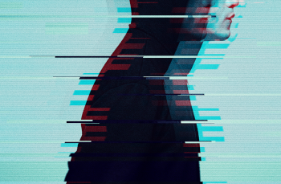
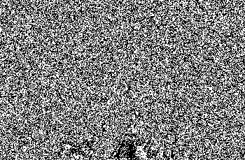
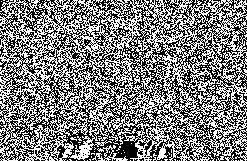
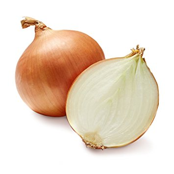
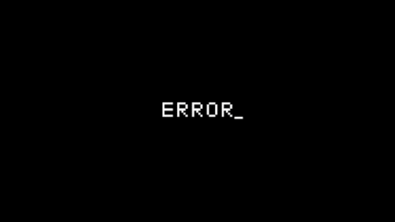

# IceCTF 2016

2-Week-long Icelandic CTF in September 2018

Team: Galaxians


## Overview
```
Title                          Category       Points Flag
------------------------------ -------------- ------ -----------------------------
Toke Relaunch                  Web            50     IceCTF{what_are_these_robots_doing_here}
Lights out                     Web            75     IceCTF{styles_turned_the_lights}
Friðfinnur                     Web            200
History of Computing           Web            350

Simple Overflow                Binary         250
Twitter                        Binary         800

Modern Picasso                 Forensics      150    IceCTF{wow_fast}
Hard Shells                    Forensics      200    IceCTF{look_away_i_am_hacking}
Lost in the Forest             Forensics      300    IceCTF{good_ol_history_lesson}

garfield                       Cryptography   100    IceCTF{I_DONT_THINK_GRONSFELD_LIKES_MONDAYS}
Posted!                        Cryptography   250
Think outside the key!         Cryptography   200
Ancient Foreign Communications Cryptography   300    IceCTF{squeamish ossifrage}

Drumbone                       Steganography  150    IceCTF{Elliot_has_been_mapping_bits_all_day}
Hot or Not                     Steganography  300    IceCTF{h0td1gg1tyd0g}
Rabbit Hole                    Steganography  400

Locked Out                     Reversing      200
Poke-A-Mango                   Reversing      250
Passworded!                    Reversing      400

Hello World!                   Misc           10      IceCTF{this_is_a_flag}
anticaptcha                    Misc           250     IceCTF{ahh_we_have_been_captchured}
ilovebees                      Misc           199
Secret Recipe                  Misc           290
```


## Web 50: Toke Relaunch

**Challenge**

We've relaunched our famous website, Toke! Hopefully no one will hack it again and take it down like the last time.


**Solution**

The link leads to some marijuna website


Last edition the toke challenge had the flag hidden in a cookie, but no cookies are set this time, so we have to look elsewhere

We check the robots.txt file and see:

```
User-agent: *
Disallow: /secret_xhrznylhiubjcdfpzfvejlnth.html

```

the disallowed file contains our flag.

**Flag**
```
IceCTF{what_are_these_robots_doing_here}
```


## Web 75: Ligths out

**Challenge**

Help! We're scared of the dark!

https://static.icec.tf/lights_out

**Solution**

We see a black page


with source:

```html
<!doctype html>
<html>
    <head>
        <meta charset="utf-8" />
        <title>Lights out!</title>
        <link rel="stylesheet" href="main.css" />
    </head>
    <body>
        <div class="alert alert-danger">Who turned out the lights?!?!</div>
        <summary>
        <div class="clearfix">
            <i data-hide="true"></i>
            <strong data-show="true">
            <small></small>
            </strong>
            <small></small>
        </div>
        </summary>
    </body>
</html>

```

Some fiddling with the css yields the flag


**Flag**

```
IceCTF{styles_turned_the_lights}
```

## Web 200: Friðfinnur

**Challenge**

Eve wants to make the hottest new website for job searching on the market! An avid PHP developer she decided to use the hottest new framework, Laravel! I don't think she knew how to deploy websites at this scale however....

https://gg4ugw5xbsr2myw-fridfinnur.labs.icec.tf/

**Solution**

**Flag**

## Web 350: History of Computing

**Challenge**

One of the authors of IceCTF made this page but I don't think it's very accurate. Can you take hack it before the IceCTF team gets sued?

**Solution**

A blogging website with registration/login forms and comment submission


If we log in we get a cookie

```
token:   eyJ0eXAiOiJKV1QiLCJhbGciOiJub25lIn0.eyJ1c2VybmFtZSI6InRlc3R1c2VyIiwiZmxhZyI6IkljZUNURntob3BlIHlvdSBkb24ndCB0aGluayB0aGlzIGlzIGEgcmVhbCBmbGFnfSJ9.
session: eyJ1c2VyIjozfQ.DnrHzA.T60QwnNSuvq2HH0VSnNqqzFZ-24
```

which base64 decode to:

```
token: {"typ":"JWT","alg":"none"}.{"username":"testuser","flag":"IceCTF{hope you don't think this is a real flag}"}
session: {"user":3}.?.?
```

**Flag**
## Binary Exploit 200: Simple Overflow

**Challenge**

In programming, a buffer overflow is a case where a program, while it is writing data somewhere, overruns the boundary and begins overwriting adjacent memory. This is one of the first vulnerabilities used to exploit software. Modern programming languages tend to provide protection against this type of vulnerability, but it is still observed commonly in low-level software.

Buffer overflows can be a complex vulnerability to understand and exploit due to their low-level nature. To assist you in your training, we have provided a memory simulation in the middle to help you understand what happens when your input in the textbox is passed to the program on the left. The simulation shows you the memory layout of the underlying process, where your buffer is red, and the secret value is green. Try entering values into the box and observe how the values that the program sees change on the left.

In this case, the buffer sits on top of the stack memory, with the variable secret sitting just below it. As you will observe, the size limitation placed on buffer is not enforced, allowing you to write more than 16 characters. Get a feel for buffer overflows by exploring the above code.

Once you are comfortable with buffer overflows, exploit the program to grant you the flag.

[overflow.c](writeupfiles/overflow.c)

**Instructions**
1. Hello world!
In the textbox in the middle, try entering Hello World!. Observe which variable within the code takes the value.

2. Overflow!
What happens if you write more than 16 characters into the buffer? Can you make the secret change?

3. Take control
Can you make secret take the value 1633771873 (0x61616161). Note that strings are stored in ASCII, and in ASCII, character number 0x61 is a.

4. Little endian
In most architectures, integers are read in reverse byte order from memory, in a method which is called Little endian. Can you make the secret take the value 1633837924 (0x61626364)?

5. Escape from ASCII
As you may see in the code, to get past the restrictions and retrieve the flag, secret needs to have a value of 0xcafebabe. However not all these characters are in ASCII! What will you do?


**Solution**

We examine the source code

```c
#define _GNU_SOURCE
#include <stdio.h>
#include <stdlib.h>
#include <string.h>
#include <unistd.h>
#include <sys/types.h>

const char* FLAG = "<REDACTED>"

void flag() {
    printf("FLAG: %s\n", FLAG);
}

void message(char *input) {

    char buf[16] = "";

    int secret = 0;

    strcpy(buf, input);

    printf("You said: %s\n", buf);

    if (secret == 0xcafebabe) {
        flag();
    } else {
        printf("The secret is 0x%x\n", secret);
    }
}

int main(int argc, char **argv) {
    if (argc > 1){
        message(argv[1]);
    } else {
        printf("Usage: ./overflow <message>\n");
    }
    return 0;
}
```

**Flag**

## Binary Exploit 800: Twitter

**Challenge**

Someone left a time machine in the basement with classic games from the 1970s. Let me play these on the job, nothing can go wrong.

```
ssh -p 2222 ssh.icec.tf -l gg4ugw5xbsr2myw-twitter
```

**Solution**

**Flag**


## Forensics 150: Modern Picasso

**Challenge**

Here's a rendition of some modern digital abstract art. Is it more than art though?


**Solution**

Using imagemagick to convert the white background in each frame to transparant:

```
convert picasso.gif -transparent white picasso_transparent.gif
```

gives a gif that slowly builds up the flag:


**Flag**

```
IceCTF{wow_fast}
```

## Forensics 200: Hard Shells

**Challenge**

After a recent hack, a laptop was seized and subsequently analyzed. The victim of the hack? An innocent mexican restaurant. During the investigation they found this suspicous file. Can you find any evidence that the owner of this laptop is the culprit?

[file](writeupfiles/hardshells)

**Solution**

the file is an encrypted zip file.

we use fcrackzip with the crackstation wordlist to find the password

```bash
$ fcrackzip -v --use-unzip  -D -p wordlist hardshells.zip
'hardshells/' is not encrypted, skipping
found file 'hardshells/d', (size cp/uc 309500/5242880, flags 9, chk 91d0)
checking pw TILIGUL'S

PASSWORD FOUND!!!!: pw == tacos
```

the [file we get](writeupfiles/d) now is a Minix filesystem

```bash
$ file d
d: Minix filesystem, V1, 30 char names, 20 zones
```

Running `strings`, we found `IHDR` indicating it might be a PNG file. Comparing
the file (in vim) to a normal PNG file we discovered they'd changed PNG to PUG
and the file became valid.

This gives us a nice screenshot of someone's desktop, with the flag.


**Flag**
```
IceCTF{look_away_i_am_hacking}
```

## Forensics 300: Lost in the Forest

**Challenge**
You've rooted a notable hacker's system and you're sure that he has hidden something juicy on there. Can you find his secret?

**Solution**
We receive a zip file named 'fs.zip' which contains a partial root file system of our hacker's machine. After unzipping we looked for all potentially interesting files:

```
find -type f .
```

And spotted './home/hkr/Desktop/clue.png' which is just a picture of a red
herring. Cute. So the other dozens of JPGs are probably also red herrings. Next
we looked for more interesting files and just looked at them individually with
a text editor:

```
vim `find -type f .`
```

Most were rather uninteresting, but there was a base64 looking string,
`./home/hkr/hzpxbsklqvboyou` which might be interesting later. In
`.bash_history` there were some interesting commands:

```
wget https://gist.githubusercontent.com/Glitch-is/bc49ee73e5413f3081e5bcf5c1537e78/raw/c1f735f7eb36a20cb46b9841916d73017b5e46a3/eRkjLlksZp
mv eRkjLlksZp tool.py
./tool.py ../secret > ../hzpxbsklqvboyou
```

So that script generated the base64 stuff on the desktop. We'll just write a [decode version of the script](./writeupfiles/lost-in-the-forest.py) and decrypt our output.


**Flag**
```
IceCTF{good_ol_history_lesson}
```

## Cryptography 100: garfeld

**Challenge**

You found the marketing campaign for a brand new sitcom. Garfeld! It has a secret message engraved on it. Do you think you can figure out what they're trying to say?


**Solution**

The image reads:

`IjgJUO{P_LOUV_AIRUS_GYQUTOLTD_SKRFB_TWNKCFT}`


Looks like the flag but encrypted somehow

Turns out to be vigenere with key `ahchbjhi`

we later realized that the `07271978` at the top of the image is a hint for this key with A=0,B=1 etc


**Flag**

```
IceCTF{I_DONT_THINK_GRONSFELD_LIKES_MONDAYS}
```

## Cryptography 250: Posted!

**Challenge**

Apparently some bitwise boi is posting flags all over the place. He gave us a hint, though.

```
DychGDZJRRsEUTI0JDViVlxeZyFIBCM7MwosGRQCMCgZJCIrGCsoRkFIajcSKhBTGx9XeTV4MDlZB1Y=
```

He also gave us another hint: 41


**Solution**

base64 decode, then probably one or more bitwise operation (due to mention of 'bitwise boi' in description), likely involving the number 41

**Flag**

## Cryptography 400: Think outside the key

**Challenge**

Estelle was messing around with her computer and she ended up outputting some garbage! Could you figure out what this means?!

Note: The flag is of the format `IceCTF{<text>}` where `<text>` is the decrypted text.

[mess.txt](writeupfiles/mess.txt)

**Solution**

```
i⇧fjag8⇧qv⇧qy4⇧dag8k0q⇧ptag86⇧s⇧hec⇧l⇧c4ag8z3ssag8⇧q7y66b
```

**Flag**
```
flag
```

## Cryptography 300: Ancient Foreign Communications

**Challenge**
We got word from a friend of ours lost in the depths of the Andorran jungles! Help us figure out what he is trying to tell us before its too late!

Note: The flag here is non-standard, in the result you should end up with some words! The flag is IceCTF{<words, lowercase, including spaces>}

**Solution**
We're given a file with hex bytes, we can use `xxd` to covnert that into the appropriate characters/bytes:

```
xxd -r -p comms.txt > out.txt
```

Which is full of some fun symbols?

```
⨅]]⌞⌞⌟[⨆]⌟]]]⨆⨆⨆⌜[[[⌝⌝⌝⌞⌝⌝⌝⌝⨆⌝⌝⌝⌞⌞⌝⌝⌝⌝⌟⌝⌝⨅⨅⌞⌞⨆[]]]⌝⌝⌝⌝]]⌟[[[⌝⌝⌝⌝⌟⌝⌝⌝⌝]]]⌞⌞⌞⌝⌝⌝⨆]⌞⌞
```

combining pigpen cipher with T9 we translate this to:


```
⨅ ]] ⌞⌞ ⌟ [ ⨆ ] ⌟ ]]] ⨆⨆⨆ ⌜ [[[ ⌝⌝⌝ ⌞ ⌝⌝⌝⌝ ⨆ ⌝⌝⌝ ⌞⌞ ⌝⌝⌝⌝ ⌟ ⌝⌝ ⨅⨅ ⌞⌞ ⨆ [ ]]] ⌝⌝⌝⌝ ]] ⌟ [[[ ⌝⌝⌝⌝ ⌟ ⌝⌝⌝⌝ ]]] ⌞⌞⌞ ⌝⌝⌝ ⨆ ] ⌞⌞
t h  e  _ m a g _ i   c   w o   r   d s    a r   e  s    _ q  u  e  a m i   s    h  _ o   s    _ s    i   f   r   a g e
```

```
the magic words are squeamish ossifrage
```

Which was the solution to a challenge ciphertext set by the inventor of RSA in 1977 ([link](https://en.wikipedia.org/wiki/The_Magic_Words_are_Squeamish_Ossifrage))

**Flag**
```
IceCTF{squeamish ossifrage}
```

## Steganography 150: Drumbone

**Challenge**

I joined a couple of hacking channels on IRC and I started recieving these strange messages. Someone sent me this image. Can you figure out if there's anything suspicous hidden in it?



**Solution**

Nothing in exif data, nothing with binwalk, nothing obvious, so we check the LSB of each challenge. The blue channel seems to consist of only odd number, this seems suspicious so we investigate furter. Mapping the LSB of each of the RGB channels to black or white gives the following result:

```python
from PIL import Image

img = Image.open('drumbone.png')
pixels = img.load()

(w,h) = img.size
print(w,h)

outimg_r = Image.new('RGB', (w,h), "white")
outimg_g = Image.new('RGB', (w,h), "white")
outimg_b = Image.new('RGB', (w,h), "white")

pixels_r = outimg_r.load()
pixels_g = outimg_g.load()
pixels_b = outimg_b.load()

for i in range(0,w):
  for j in range(0,h):
    (r,g,b) = pixels[i,j]
    if not r&1:
        pixels_r[i,j] = (0,0,0)
    if not g&1:
        pixels_g[i,j] = (0,0,0)
    if not b&1:
        pixels_b[i,j] = (0,0,0)

outimg_r.save("outimg_r.png")
outimg_g.save("outimg_g.png")
outimg_b.save("outimg_b.png")
```

This gives us the following images:





Bingpot! the blue channel seems to contain a QR code!

We clean up the image a bit to get our flag:


```python
from PIL import Image

img = Image.open('drumbone.png')
pixels = img.load()

(w,h) = img.size
outimg_b = Image.new('RGB', (outw,outh), "white")
pixels_b = outimg_b.load()

wout = -1
hout = -1
for i in range(1,w,6):
  wout += 1
  hout = -1
  for j in range(1,h,6):
    hout+=1
    (r,g,b) = pixels[i,j]
    if not b&1:
        pixels_b[wout,hout] = (0,0,0)

outimg_b = outimg_b.resize((10*outw,10*outh))
outimg_b.save("outimg_b.png")
```


**Flag**
```
IceCTF{Elliot_has_been_mapping_bits_all_day}
```


## Steganography 300: Hot or Not

**Challenge**

According to my friend Zuck, the first step on the path to great power is to rate the relative hotness of stuff... think Hot or Not.


(this is a scaled-down image, original was >70Mb)


**Solution**

Looking at the image more closely, we see it is made up of a series of subimages of either dogs or hotdogs.


Looks like we have to classify the subimages into hotdogs or regular dogs..

First we split the image up into all its subimages with imagemagick

```bash
$ convert -crop 224x224 +repage hotdogs/out%04d.jpg
```

Next, we can use [Clarifai](https://clarifai.com) to do the image recognition to determine whether the subimages are dogs or hotdogs. Clarifai gives you 5000 free operations per month, but since we have a little over 7500 subimages, we needed two accounts to perform this analysis.

```python
import os
import json
from PIL import Image
from clarifai.rest import ClarifaiApp
from clarifai.rest import Image as ClImage

app = ClarifaiApp(api_key='f7f15032b1a04f1fafc2092c63e50e9f')
model = app.models.get('general-v1.3')

# detect image contents for all subimages
pixels = []
for i in range(0,87*87):
    image = ClImage(file_obj=open("hotdogs/out"+str(i).zfill(4)+".jpg", 'rb'))
    response = model.predict([image])

    hot = False
    concepts = response['outputs'][0]['data']['concepts']
    for concept in concepts:
        if 'food' in concept['name']:
            hot = True
    pixels += [1 if hot == True else 0]

# make qr code image
(w,h)=(87,87)

outimg = Image.new( 'RGB', (w,h), "white")
pixels_out = outimg.load()

p = 0
for i in range(0,h):
    for j in range(0,w):
        print(pixels[p])
        if pixels[p] == 1:
            pixels_out[j,i]=(0,0,0)
        else:
            pixels_out[j,i]=(255,255,255)
        p += 1

outimg = outimg.resize((5*w,5*h))
outimg.save("pixels_outimg2.png","png")
```

This outputs the following image:


This is clearly a QR code, it is just missing the corner anchors. We add these and clean the image up slightly:


**Flag**
```
IceCTF{h0td1gg1tyd0g}
```


## Steganography 400: Rabbit Hole

**Challenge**

Here's a picture of my favorite vegetable. I hope it doesn't make you cry.



**Solution**

After a lot of experimenting, we find out we can uncover a hidden message from the image using steghide:

```bash
$ steghide extract -sf rabbithole.jpg
Enter passphrase: <onion>
wrote extracted data to "address.txt".
```

whoo! contents of the file `address.txt` is:

```
wsqxiyhn23zdi6ia
```

might be an `.onion` link? Opening `http://wsqxiyhn23zdi6ia.onion` with a tor browser gives (or via https://onion.link/):

[rabbithole.html](writeupfiles/rabbithole.html)

```html
CTYPE HTML>
<html>
    <head>
        <title>Rabbit Hole</title>
	<meta charset="UTF-8">
        <style>
            body {
                background: black;
            }

            p {
                max-width: 750px;
                text-align: center;
                color: #00ff00;
                margin: 0px auto;
            }

            #header {
                max-width: 989px;
                margin: 0px auto;
            }

            #footer {
                margin: 100px 0;
                text-align: center;
            }

            #error {
                max-width: 350px;
            }

            #eyes {
                max-width: 200px;
            }
        </style>
    </head>
    <body>
        <div id="header">
            
        </div>
        <p>聐㠃㐊㐀㐀膜舕㐀㐀㐀㐀㐀㐀㐵㐜ꕳ𓅡𔕨𓁯𓅤   [..] </p>

         <div id="footer">
             
         </div>
    </body>
</html>

```




**Flag**
```
flag
```

## Reverse Engineering 200: Locked out

**Challenge**
This is a fancy looking lock, I wonder what would happen if you broke it open?

```
ssh -p 2222 ssh.icec.tf -l gg4ugw5xbsr2myw-lockedout
```

Note: the binary is [here](writeupfiles/lock)

**Solution**

**Flag**

## Reverse Engineering: Poke-A-Mango

**Challenge**

I love these new AR games that have been coming out recently, so I decided that I would make my own with my favorite fruit! The Mango!

Can you poke 151 mangos?

NOTE Make sure that you allow the app access to your GPS location and camera otherwise the app will not work. You can do that in App Permissions in Settings.

[apk](writeupfiles/pokemango.apk)

**Solution**

installing the app gives a map and a shop menu where it appears you need to find 151 mangoes to get the flag


We decompile the app:

```
apktool decode pokemango.apk
```

**Flag**
```

```

## Reverse Engineering 400: Passworded!

**Challenge**

Alice loves to cause mayhem, and recently she sent this message to Bob! Bob is nothing but confused, leading to him asking for your help. Don't let the world descend into chaos!

Note: The flag is of the format `IceCTF{<text>}` where `<text>` is the string the program accepts.

[password.txt](writeupfiles/password.txt)


**Solution**

```
(((())|}|}|}|(][)||(}[}||(){[)|(<}|||}|(){[)|(<}(())))|}|{(((}[)||<{(}[)|<(}<(}>|>|||||}||<{(}[)|<>(}>||||}|||}(())))|})|<((}[)||<{(}[)|<(}[))))|>|>|||}||<{(}[)|<>(}>||||}||())|{(}[)|<(}[((((())|}|}|}|}|}(((())|}|}|}|}))))||(}<())[)||||{((}>|[)|<<({<(}[)|||>(}|>|}><}||||||}((((((((((((((((((((())|}|}|}|}|}|}|}|}|}|}|}|}|}|}|}|}|}|}|}|}((((((((((((((((((())|}|}|}|}|}|}|}|}|}|}|}|}|}|}|}|}|}|}|}((((((((((((((((())|}|}|}|}|}|}|}|}|}|}|}|}|}|}|}|}|}(((((((((((((((())|}|}|}|}|}|}|}|}|}|}|}|}|}|}|}|}((((((((((((((())|}|}|}|}|}|}|}|}|}|}|}|}|}|}|}((((((((((((())|}|}|}|}|}|}|}|}|}|}|}|}|}((((((((((())|}|}|}|}|}|}|}|}|}|}|}(((((((((())|}|}|}|}|}|}|}|}|}|}((((((((())|}|}|}|}|}|}|}|}|}(((((((())|}|}|}|}|}|}|}|}((((((())|}|}|}|}|}|}|}|(}[}||(){[)|(<}|||}|(){[)|(<}(((((())|}|}|}|}|}[()))|}))||(}(>||>([)|)[)|{)<<((}||{(}[)||>|}|||}><}}||(){[)|(<}((}|()||{(}[)|<([}|)||||}(){[)|(<}|||}|((}(}||[(}[}||||(((((())|}|}|}|}|}[(())|}|}))))||(}[}||(){[)|(<}|||}|({<}|}((<)||||<}}||(){[)|(<}(()))|})|((}(}||[(}[}||||(}(>||>([)|{)<((}||{(}[)||>|}||}><}}||(()))))|}|(}[}||(){[)|(<}|||}|(){[)|(<}(())|}|({)(}[)|||}))|({)(}[)|||}|(}[}||(){[)|(<}|||}|(){[)|(<}((((}||||(()))))|}|(()))))|}|(}>|({<(}[)|||>(}|>|}><}||((}(}||[(}[}||||(}(>||>{((}||{(}[)||>|}|}>([})|}|([}|}|(()))))|}|(()))))|}|(}>|({<(}[)|||>(}|>|}><}||((}(}||[(}[}||||(}(>||>([)|{)<((}||{(}[)||>|}||}><}}||()|(}[}||(){[)|(<}|||}|((}(}||[(}[}||||(()))))|}|((}(}||[(}[}||||(}(>||>{((}||{(}[)||>|}|}>([})|}|()|(}[}||(){[)|(<}|||}|({<}|}((<)||||<}}||((}||((}((}(}||[(}[}|||||[(}[}||||(}[}||(()))))|}|((}(}||[(}[}||||(}(>||>([)|{)<((}||{(}[)||>|}||}><}}||(()))))|}|((}(}||[(}[}||||(}(>||>{((}||{(}[)||>|}|}>([})|}|({<}|}((<)||||<}}||(){[)|(<}())|())[)[))||[)||(}>|({<(}[)|||>(}|>|}><}||(())|})|()))))|(}>|({<(}[)|||>(}|>|}><}||(}>|({<(}[)|||>(}|>|}><}||(}[}||(){[)|(<}|||}|(){[)|(<}((())|}|}|({(}|(}|(}[)|||}|(()))))|}|([}|}|(}[}||(){[)|(<}|||}|(){[)|(<}()>|>|||}|{}((<(]|{(}[)|<}|||}||||}|||}|{}((<(]|{(}[)|<}|||}||||}|||}|{}((<(]|{(}[)|<}|||}||||}|||}|{}((<(]|{(}[)|<}|||}||||}|||}|{}((<(]|{(}[)|<}|||}||||}|||}|{}((<(]|{(}[)|<}|||}||||}|||}|{}((<(]|{(}[)|<}|||}||||}|||}|{}((<(]|{(}[)|<}|||}||||}|||}(>{<}|}((<)||||<}}|>||||}|{}((<(]|{(}[)|<}|||}||||}
```

**Flag**
```
flag
```


## Misc 10: Hello World!

**Challenge**

Welcome to the competition! To get you started we decided to give you your first flag. The flags all start with the "IceCTF" and have some secret message contained with in curly braces "{" and "}".

Within this platform, the challenges will be shown inside a frame to the right. For example purposes the download interface is shown on the right now. For static challenges you will need to click the large button in order to receive your challenge. For non static challenges, the lab itself will be shown on the right.

To submit the flag you can click the blue flag button in the bottom right hand corner.

Your flag is `IceCTF{this_is_a_flag}`

**Solution**

`CTRL+C, CTRL+V`

**Flag**

```
IceCTF{this_is_a_flag}
```

## Misc 250: anticaptcha

**Challenge**

Wow, this is a big captcha. Who has enough time to solve this? Seems like a lot of effort to me!

https://gg4ugw5xbsr2myw-anticaptcha.labs.icec.tf/


**Solution**

looks like we will have to answer these questions to get the flag. We automate this:

```python

from bs4 import BeautifulSoup
import requests
from fractions import gcd as _gcd
import math
import re
import sys
from itertools import count, islice
from math import sqrt

URL = "https://gg4ugw5xbsr2myw-anticaptcha.labs.icec.tf/"

def isprime(n):
    n = int(n)
    return n > 1 and all(n%i for i in islice(count(2), int(sqrt(n)-1)))

def gcd(a, b):
    return _gcd(int(a), int(b))

def nthword(a, b):
    return b.replace('.',' ').replace('  ',' ').split(' ')[int(a)]


asdf = {
    'What is the greatest common divisor of (?P<a>[0-9]+) and (?P<b>[0-9]+)?': gcd,
    'Is (?P<a>[0-9]+) a prime number?': isprime,
    'What is the (?P<a>[0-9]+).. word in the following line:(?P<b>.*)': nthword,
    'What is the tallest mountain on Earth?': lambda: "Mount Everest",
    'What is the capital of Hawaii?': lambda: "Honolulu",
    'What color is the sky?': lambda: "blue",
    'What year is it?': lambda: "2018",
    'Who directed the movie Jaws?': lambda: "Steven Spielberg",
    'What is the capital of Germany?': lambda: "Berlin",
    'Which planet is closest to the sun?': lambda: "Mercury",
    'How many strings does a violin have?': lambda: "4",
    'How many planets are between Earth and the Sun?': lambda: "2",
}


data = requests.get(URL)

answers = []

html_doc = data.text
soup = BeautifulSoup(html_doc, 'html.parser')
for idx, td in enumerate(soup.find_all('td')):
    if idx % 2 == 1:
        continue

    text = td.text.replace('\n', '')

    matched = False
    for (m, func) in asdf.items():
        match = re.match(m, text)
        if match:
            matched = True
            answers.append(str(func(*match.groups())))

    if not matched:
        print("> %s <" % text)


r = requests.post(URL, headers={'Content-type': 'application/x-www-form-urlencoded'}, data={'answer': answers})
print(r.text[:1000])
```

when we get it right, the page responds with our flag

**Flag**
```
IceCTF{ahh_we_have_been_captchured}
```


## Misc 200: ilovebees

**Challenge**

I stumbled on to this strange website. It seems like a website made by a flower enthusiast, but it appears to have been taken over by someone... or something.

Can you figure out what it's trying to tell us?

https://static.icec.tf/iloveflowers/

**Solution**

website:


**Flag**
```
flag
```


## Misc 300: Secret Recipe

**Challenge**

I found this secret recipe when I was digging around in my Icelandic grandmother's attic. I have a feeling that she might have been a part of some secret organization. Can you see if there are any other secrets hidden in the recipe?


**Solution**

Transcription:

> Leyniuppskrift:
>
> Byrjaðu á að brjóta 5 egg og setja svo 3 matskeiðar af skyri í skál. Hrærið
> svo 9 desilítra af hveiti út í ásamt 3 desilítrum af mjólk. Svo skal setja 7
> teskeiðar af lyftidufti og 2 teskeiðar af vanilludropum áður enn það eru sett
> 9 grömm af smjöri í skálina.
>
> Hrærið þessu rækilega saman og setjið svo út á pönnu.
>
> Alveg eins og amma gerði þða

Translation:

> Secret Recipe
>
> Start breaking 5 eggs and then put 3 tablespoons of sprouts into a bowl. Stir
> 9 decilitres of flour together with 3 deciliters of milk. Then put 7
> teaspoons of baking soda and 2 teaspoons of vanilla pods before putting 9
> grams of butter in the bowl.
>
> Stir this thoroughly and then place it on a pan.
>
> Just like a grandmother made a pillow


**Flag**
```
flag
```

